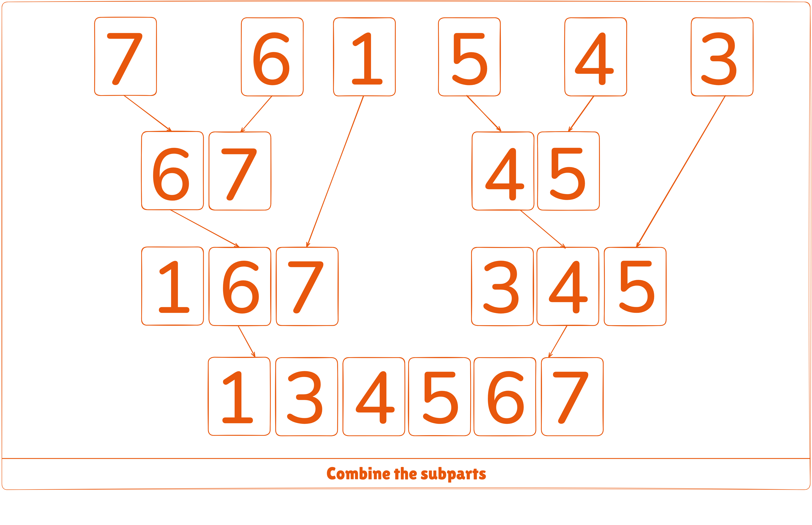

A **divide and conquer algorithm** is a strategy of solving a large problem by

1. breaking the problem into smaller sub-problems
2. solving the sub-problems, and
3. combining them to get the desired output.

To use the divide and conquer algorithm, **recursion** is used. Learn about recursion in different programming languages:

## How Divide and Conquer Algorithms Work?
Here are the steps involved:

1. **Divide**: Divide the given problem into sub-problems using recursion.
2. **Conquer**: Solve the smaller sub-problems recursively. If the subproblem is small enough, then solve it directly.
3. **Combine**: Combine the solutions of the sub-problems that are part of the recursive process to solve the actual problem.

Let us understand this concept with the help of an example.

Here, we will sort an array using the divide and conquer approach ```(ie. merge sort)```.

1. Let the given array be:


2. **Divide** the array into two halves.


Again, divide each subpart recursively into two halves until you get individual elements.


3. Now, combine the individual elements in a sorted manner. Here, conquer and combine steps go side by side.



## Time Complexity

The complexity of the divide and conquer algorithm is calculated using the **master theorem**.

```bash
T(n) = aT(n/b) + f(n),
where,
n = size of input
a = number of subproblems in the recursion
n/b = size of each subproblem. All subproblems are assumed to have the same size.
f(n) = cost of the work done outside the recursive call, which includes the cost of dividing the problem and cost of merging the solutions
```

Let us take an example to find the time complexity of a recursive problem.

For a merge sort, the equation can be written as:

```bash
T(n) = aT(n/b) + f(n)
     = 2T(n/2) + O(n)
Where, 
a = 2 (each time, a problem is divided into 2 subproblems)
n/b = n/2 (size of each sub problem is half of the input)
f(n) = time taken to divide the problem and merging the subproblems
T(n/2) = O(n log n) (To understand this, please refer to the master theorem.)

Now, T(n) = 2T(n log n) + O(n)
          ≈ O(n log n)
```

## Divide and Conquer Vs Dynamic approach
The divide and conquer approach divides a problem into smaller subproblems; these subproblems are further solved recursively. The result of each subproblem is not stored for future reference, whereas, in a dynamic approach, the result of each subproblem is stored for future reference.

Use the divide and conquer approach when the same subproblem is not solved multiple times. Use the dynamic approach when the result of a subproblem is to be used multiple times in the future.

Let us understand this with an example. Suppose we are trying to find the Fibonacci series. Then,

**Divide and Conquer approach:**

```bash
fib(n)
    If n < 2, return 1
    Else , return f(n - 1) + f(n -2)
```

**Dynamic approach:**

```bash
mem = []
fib(n)
    If n in mem: return mem[n] 
    else,     
        If n < 2, f = 1
        else , f = f(n - 1) + f(n -2)
        mem[n] = f
        return f
```

In a dynamic approach, ```mem``` stores the result of each subproblem.

## Advantages of Divide and Conquer Algorithm
1. The complexity for the multiplication of two matrices using the naive method is ```O(n^3)```, whereas using the divide and conquer approach (i.e. Strassen's matrix multiplication) is ```O(n^2.8074)```. This approach also simplifies other problems, such as the Tower of Hanoi.
2. This approach is suitable for multiprocessing systems.
3. It makes efficient use of memory caches.

## Divide and Conquer Applications
* Binary Search
* Merge Sort
* Quick Sort
* Strassen's Matrix multiplication
* Karatsuba Algorithm
