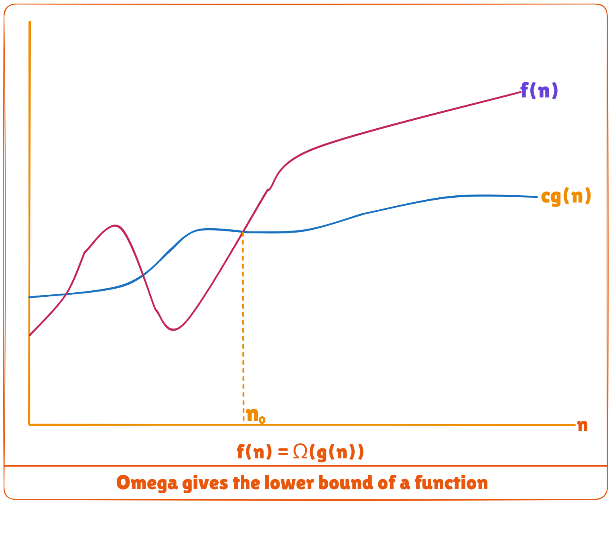
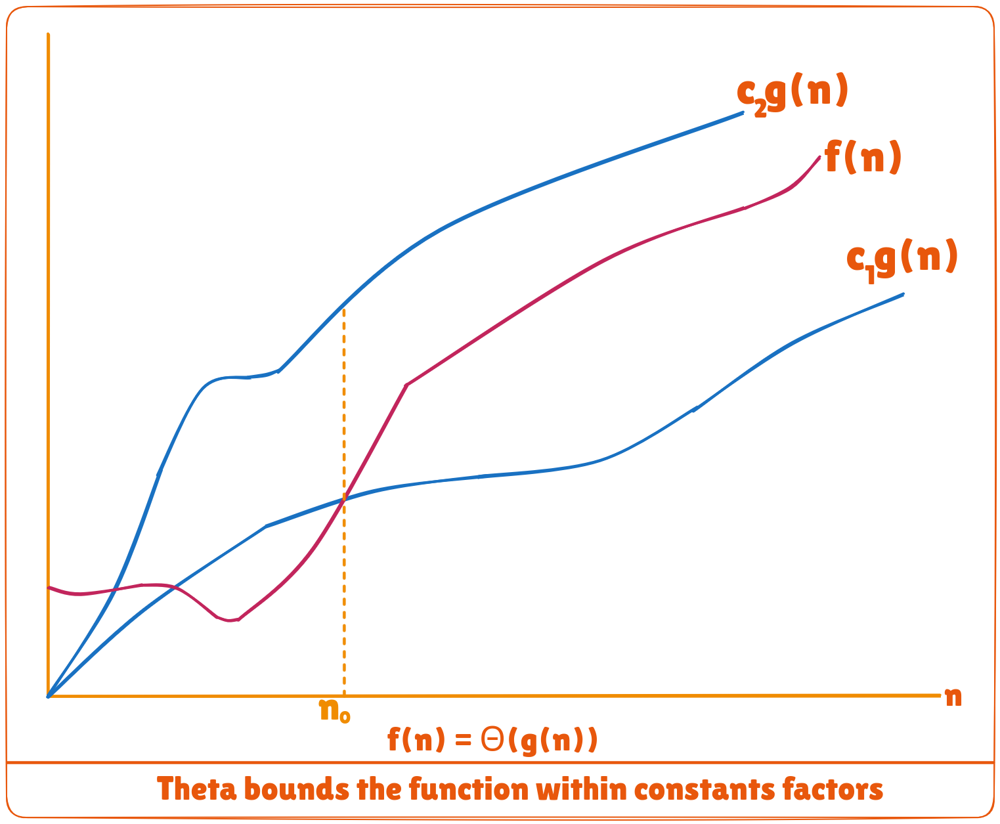

An algorithm may not have the same performance for different types of inputs. With the increase in the input size, the performance will change.

The study of change in performance of the algorithm with the change in the order of the input size is defined as asymptotic analysis.

## Asymptotic Notations
Asymptotic notations are the mathematical notations used to describe the running time of an algorithm when the input tends towards a particular value or a limiting value.

For example: In bubble sort, when the input array is already sorted, the time taken by the algorithm is linear i.e. the best case.

But, when the input array is in reverse condition, the algorithm takes the maximum time (quadratic) to sort the elements i.e. the worst case.

When the input array is neither sorted nor in reverse order, then it takes average time. These durations are denoted using asymptotic notations.

There are mainly three asymptotic notations:
* Big-O notation
* Omega notation
* Theta notation

### Big-O Notation (O-notation)
Big-O notation represents the upper bound of the running time of an algorithm. Thus, it gives the worst-case complexity of an algorithm.


```bash
O(g(n)) = { f(n): there exist positive constants c and n0
            such that 0 ≤ f(n) ≤ cg(n) for all n ≥ n0 }
```

The above expression can be described as a function ```f(n)``` belongs to the set ```O(g(n))``` if there exists a positive constant ```c``` such that it lies between ```0``` and ```cg(n)```, for sufficiently large ```n```.

For any value of ```n```, the running time of an algorithm does not cross the time provided by ```O(g(n))```.

Since it gives the worst-case running time of an algorithm, it is widely used to analyze an algorithm as we are always interested in the worst-case scenario.

### Omega Notation (Ω-notation)
Omega notation represents the lower bound of the running time of an algorithm. Thus, it provides the best case complexity of an algorithm.



```bash
Ω(g(n)) = { f(n): there exist positive constants c and n0 
            such that 0 ≤ cg(n) ≤ f(n) for all n ≥ n0 }
```

The above expression can be described as a function ```f(n)``` belongs to the set ```Ω(g(n))``` if there exists a positive constant ```c``` such that it lies above ```cg(n)```, for sufficiently large ```n```.

For any value of ```n```, the minimum time required by the algorithm is given by Omega ```Ω(g(n))```.

### Theta Notation (Θ-notation)
Theta notation encloses the function from above and below. Since it represents the upper and the lower bound of the running time of an algorithm, it is used for analyzing the average-case complexity of an algorithm.



For a function ```g(n)```, ```Θ(g(n))``` is given by the relation:

```bash
Θ(g(n)) = { f(n): there exist positive constants c1, c2 and n0
            such that 0 ≤ c1g(n) ≤ f(n) ≤ c2g(n) for all n ≥ n0 }
```

The above expression can be described as a function ```f(n)``` belongs to the set ```Θ(g(n))``` if there exist positive constants ```c1``` and ```c2``` such that it can be sandwiched between ```c1g(n)``` and ```c2g(n)```, for sufficiently large ```n```.

If a function ```f(n)``` lies anywhere in between ```c1g(n)``` and ```c2g(n)``` for all ```n ≥ n0```, then ```f(n)``` is said to be asymptotically tight bound.