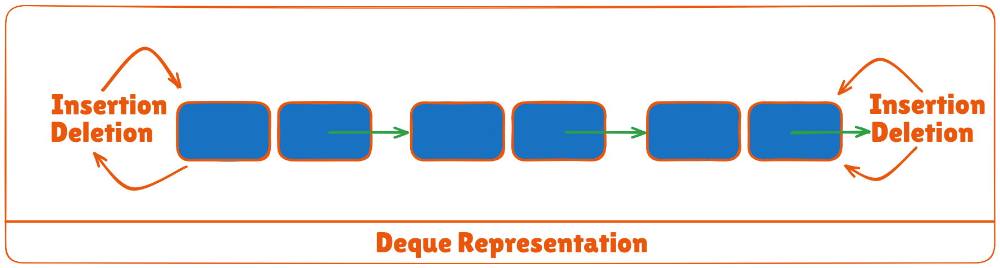

A queue is a useful data structure in programming. It is similar to the ticket queue outside a cinema hall, where the first person entering the queue is the first person who gets the ticket.

There are four different types of queues:

* Simple Queue
* Circular Queue
* Priority Queue
* Double Ended Queue

## Simple Queue
In a simple queue, insertion takes place at the rear and removal occurs at the front. It strictly follows the FIFO (First in First out) rule.

## Circular Queue
In a circular queue, the last element points to the first element making a circular link.

The main advantage of a circular queue over a simple queue is better memory utilization. If the last position is full and the first position is empty, we can insert an element in the first position. This action is not possible in a simple queue.

## Priority Queue
A priority queue is a special type of queue in which each element is associated with a priority and is served according to its priority. If elements with the same priority occur, they are served according to their order in the queue.

Insertion occurs based on the arrival of the values and removal occurs based on priority.

## Deque (Double Ended Queue)
In a double ended queue, insertion and removal of elements can be performed from either from the front or rear. Thus, it does not follow the FIFO (First In First Out) rule.

