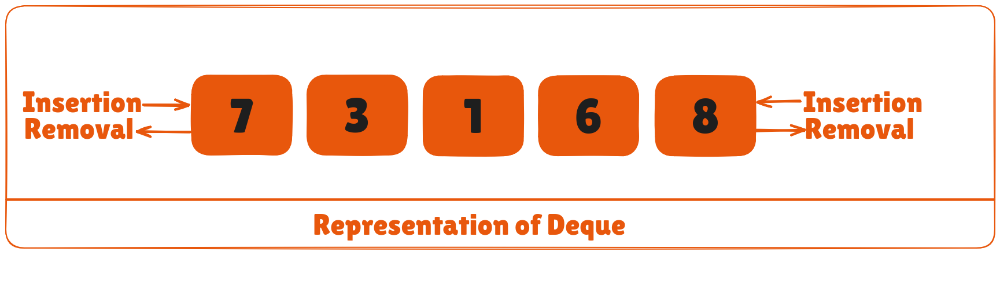
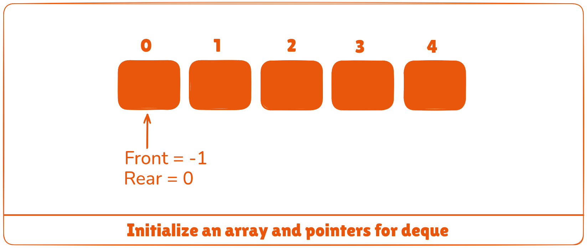
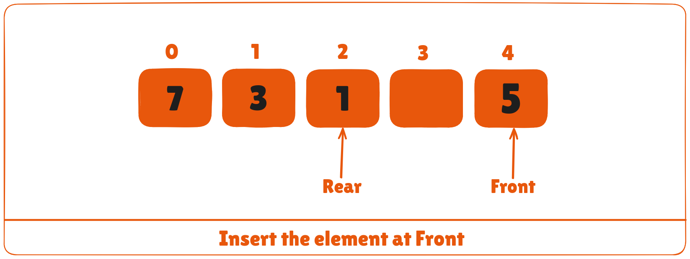

Deque or Double Ended Queue is a type of queue in which insertion and removal of elements can either be performed from the front or the rear. Thus, it does not follow FIFO rule (First In First Out).



## Types of Deque
* Input Restricted Deque

In this deque, input is restricted at a single end but allows deletion at both the ends.

* Output Restricted Deque

In this deque, output is restricted at a single end but allows insertion at both the ends.

## Operations on a Deque
Below is the circular array implementation of deque. In a circular array, if the array is full, we start from the beginning.

But in a linear array implementation, if the array is full, no more elements can be inserted. In each of the operations below, if the array is full, "overflow message" is thrown.

Before performing the following operations, these steps are followed.

1. Take an array (deque) of size ```n```.
2. Set two pointers ```front = -1``` and ```rear = 0```.



### 1. Insert at the Front
This operation adds an element at the front.

1. Check if the deque is full.
2. If the deque is full (i.e. **(front == 0 && rear == n - 1) || (front == rear + 1))**, insertion operation cannot be performed (**overflow condition**).
3. If the deque is empty, reinitialize **front = 0**. And, add the new key into **array[front]**.
4. If **front = 0**, reinitialize **front = n-1** (last index).


5. Else, decrease **front** by 1.
6. Add the new key ```5``` into **array[front]**.

