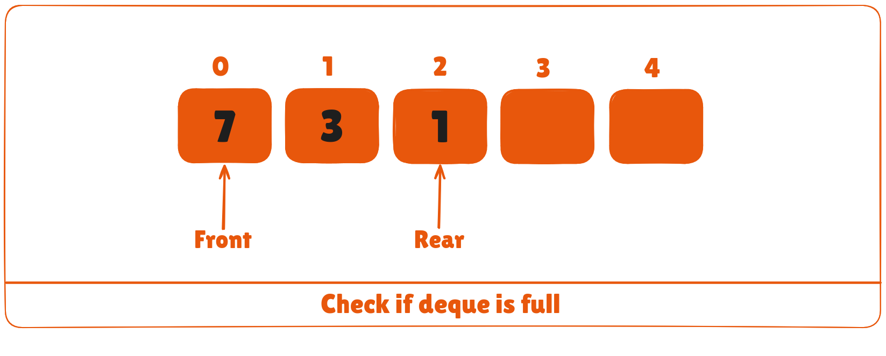
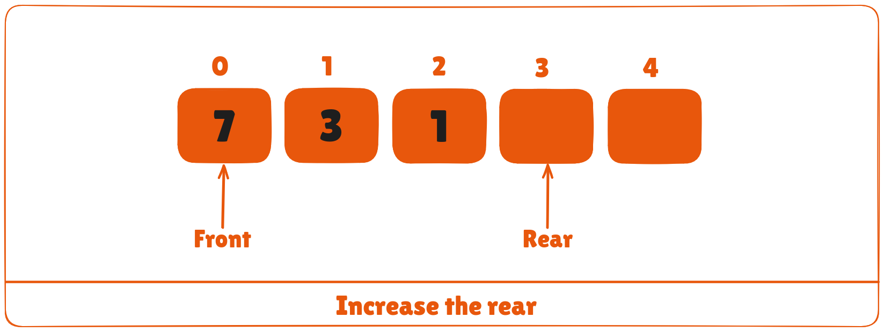
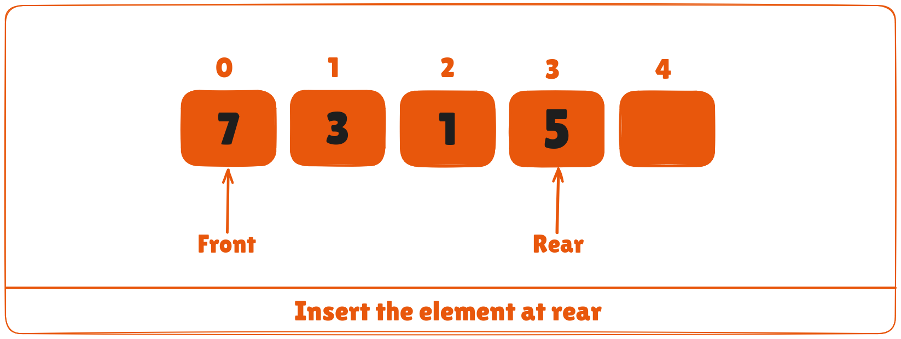
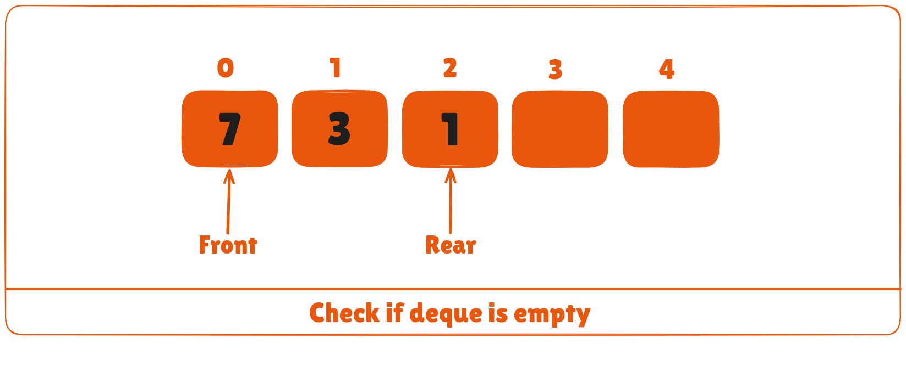
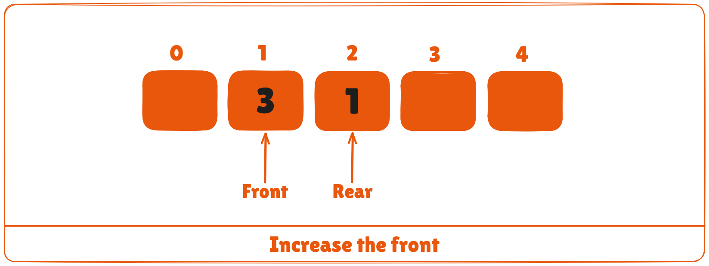
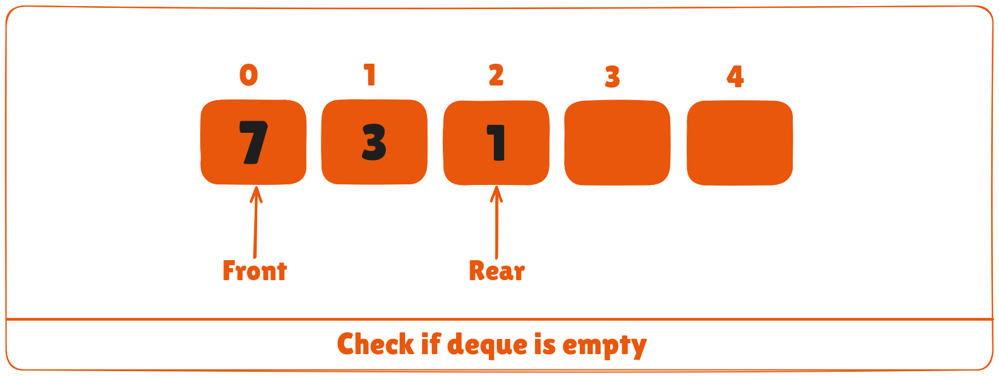
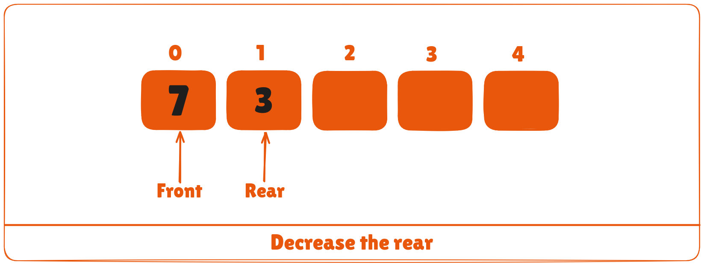

Deque or Double Ended Queue is a type of queue in which insertion and removal of elements can either be performed from the front or the rear. Thus, it does not follow FIFO rule (First In First Out).


## Types of Deque
* Input Restricted Deque

In this deque, input is restricted at a single end but allows deletion at both the ends.

* Output Restricted Deque

In this deque, output is restricted at a single end but allows insertion at both the ends.

## Operations on a Deque
Below is the circular array implementation of deque. In a circular array, if the array is full, we start from the beginning.

But in a linear array implementation, if the array is full, no more elements can be inserted. In each of the operations below, if the array is full, "overflow message" is thrown.

Before performing the following operations, these steps are followed.

1. Take an array (deque) of size ```n```.
2. Set two pointers ```front = -1``` and ```rear = 0```.


### 1. Insert at the Front
This operation adds an element at the front.

1. Check if the deque is full.
2. If the deque is full (i.e. ```(front == 0 && rear == n - 1) || (front == rear + 1))```, insertion operation cannot be performed (```overflow condition```).
3. If the deque is empty, reinitialize ```front = 0```. And, add the new key into ```array[front]```.
4. If ```front = 0```, reinitialize ```front = n-1``` (last index).


5. Else, decrease ```front``` by 1.
6. Add the new key ```5``` into ```array[front]```.


### 2. Insert at the Rear
This operation adds an element to the rear.

1. Check if the deque is full.



2. If the deque is full, insertion operation cannot be performed (```overflow condition```).
3. If the deque is empty, reinitialize ```rear = 0```. And, add the new key into ```array[rear]```.
4. If ```rear = n - 1```, reinitialize ```rear = 0``` (first index).
5. Else, increase ```rear``` by 1.



6. Add the new key ```5``` into ```array[rear]```.



### 3. Delete from the Front
The operation deletes an element from the ```front```.

1. Check if the deque is empty.



2. If the deque is empty (i.e. ```front = -1```), deletion cannot be performed (```underflow condition```).
3. If the deque has only one element (i.e. ```front = rear```), set ```front = -1``` and ```rear = -1```.
4. Else if front is at the last index (i.e. ```front = n - 1```), set ```front = 0```.
5. Else, ```front = front + 1```.



### 4. Delete from the Rear

This operation deletes an element from the ```rear```.

1. Check if the deque is empty.



2. If the deque is empty (i.e. ```front = -1```), deletion cannot be performed (```underflow condition```).
3. If the deque has only one element (i.e. ```front = rear```), set ```front = -1``` and ```rear = -1```, else follow the steps below.
4. If ```rear``` is at the first index (i.e. ```rear = 0```), reinitialize ```rear = n - 1```.
5. Else, ```rear = rear - 1```.



### 5. Check Empty
This operation checks if the deque is empty. If ```front = -1```, the deque is empty.

### 6. Check Full
This operation checks if the deque is full. If ```front = 0``` and ```rear = n - 1``` OR ```front = rear + 1```, the deque is full.

## Deque Implementation in Python, Java, C, and C++

<CodeGroup>

```python Python
# Deque implementaion in python

class Deque:
    def __init__(self):
        self.items = []

    def isEmpty(self):
        return self.items == []

    def addRear(self, item):
        self.items.append(item)

    def addFront(self, item):
        self.items.insert(0, item)

    def removeFront(self):
        return self.items.pop(0)

    def removeRear(self):
        return self.items.pop()

    def size(self):
        return len(self.items)


d = Deque()
print(d.isEmpty())
d.addRear(8)
d.addRear(5)
d.addFront(7)
d.addFront(10)
print(d.size())
print(d.isEmpty())
d.addRear(11)
print(d.removeRear())
print(d.removeFront())
d.addFront(55)
d.addRear(45)
print(d.items)
```

```java Java
// Deque implementation in Java

class Deque {
  static final int MAX = 100;
  int arr[];
  int front;
  int rear;
  int size;

  public Deque(int size) {
    arr = new int[MAX];
    front = -1;
    rear = 0;
    this.size = size;
  }

  boolean isFull() {
    return ((front == 0 && rear == size - 1) || front == rear + 1);
  }

  boolean isEmpty() {
    return (front == -1);
  }

  void insertfront(int key) {
    if (isFull()) {
      System.out.println("Overflow");
      return;
    }

    if (front == -1) {
      front = 0;
      rear = 0;
    }

    else if (front == 0)
      front = size - 1;

    else
      front = front - 1;

    arr[front] = key;
  }

  void insertrear(int key) {
    if (isFull()) {
      System.out.println(" Overflow ");
      return;
    }

    if (front == -1) {
      front = 0;
      rear = 0;
    }

    else if (rear == size - 1)
      rear = 0;

    else
      rear = rear + 1;

    arr[rear] = key;
  }

  void deletefront() {
    if (isEmpty()) {
      System.out.println("Queue Underflow\n");
      return;
    }

    // Deque has only one element
    if (front == rear) {
      front = -1;
      rear = -1;
    } else if (front == size - 1)
      front = 0;

    else
      front = front + 1;
  }

  void deleterear() {
    if (isEmpty()) {
      System.out.println(" Underflow");
      return;
    }

    if (front == rear) {
      front = -1;
      rear = -1;
    } else if (rear == 0)
      rear = size - 1;
    else
      rear = rear - 1;
  }

  int getFront() {
    if (isEmpty()) {
      System.out.println(" Underflow");
      return -1;
    }
    return arr[front];
  }

  int getRear() {
    if (isEmpty() || rear < 0) {
      System.out.println(" Underflow\n");
      return -1;
    }
    return arr[rear];
  }

  public static void main(String[] args) {

    Deque dq = new Deque(4);

    System.out.println("Insert element at rear end : 12 ");
    dq.insertrear(12);

    System.out.println("insert element at rear end : 14 ");
    dq.insertrear(14);

    System.out.println("get rear element : " + dq.getRear());

    dq.deleterear();
    System.out.println("After delete rear element new rear become : " + dq.getRear());

    System.out.println("inserting element at front end");
    dq.insertfront(13);

    System.out.println("get front element: " + dq.getFront());

    dq.deletefront();

    System.out.println("After delete front element new front become : " + +dq.getFront());

  }
}
```

```c C
// Deque implementation in C

#include <stdio.h>

#define MAX 10

void addFront(int *, int, int *, int *);
void addRear(int *, int, int *, int *);
int delFront(int *, int *, int *);
int delRear(int *, int *, int *);
void display(int *);
int count(int *);

int main() {
  int arr[MAX];
  int front, rear, i, n;

  front = rear = -1;
  for (i = 0; i < MAX; i++)
    arr[i] = 0;

  addRear(arr, 5, &front, &rear);
  addFront(arr, 12, &front, &rear);
  addRear(arr, 11, &front, &rear);
  addFront(arr, 5, &front, &rear);
  addRear(arr, 6, &front, &rear);
  addFront(arr, 8, &front, &rear);

  printf("\nElements in a deque: ");
  display(arr);

  i = delFront(arr, &front, &rear);
  printf("\nremoved item: %d", i);

  printf("\nElements in a deque after deletion: ");
  display(arr);

  addRear(arr, 16, &front, &rear);
  addRear(arr, 7, &front, &rear);

  printf("\nElements in a deque after addition: ");
  display(arr);

  i = delRear(arr, &front, &rear);
  printf("\nremoved item: %d", i);

  printf("\nElements in a deque after deletion: ");
  display(arr);

  n = count(arr);
  printf("\nTotal number of elements in deque: %d", n);
}

void addFront(int *arr, int item, int *pfront, int *prear) {
  int i, k, c;

  if (*pfront == 0 && *prear == MAX - 1) {
    printf("\nDeque is full.\n");
    return;
  }

  if (*pfront == -1) {
    *pfront = *prear = 0;
    arr[*pfront] = item;
    return;
  }

  if (*prear != MAX - 1) {
    c = count(arr);
    k = *prear + 1;
    for (i = 1; i <= c; i++) {
      arr[k] = arr[k - 1];
      k--;
    }
    arr[k] = item;
    *pfront = k;
    (*prear)++;
  } else {
    (*pfront)--;
    arr[*pfront] = item;
  }
}

void addRear(int *arr, int item, int *pfront, int *prear) {
  int i, k;

  if (*pfront == 0 && *prear == MAX - 1) {
    printf("\nDeque is full.\n");
    return;
  }

  if (*pfront == -1) {
    *prear = *pfront = 0;
    arr[*prear] = item;
    return;
  }

  if (*prear == MAX - 1) {
    k = *pfront - 1;
    for (i = *pfront - 1; i < *prear; i++) {
      k = i;
      if (k == MAX - 1)
        arr[k] = 0;
      else
        arr[k] = arr[i + 1];
    }
    (*prear)--;
    (*pfront)--;
  }
  (*prear)++;
  arr[*prear] = item;
}

int delFront(int *arr, int *pfront, int *prear) {
  int item;

  if (*pfront == -1) {
    printf("\nDeque is empty.\n");
    return 0;
  }

  item = arr[*pfront];
  arr[*pfront] = 0;

  if (*pfront == *prear)
    *pfront = *prear = -1;
  else
    (*pfront)++;

  return item;
}

int delRear(int *arr, int *pfront, int *prear) {
  int item;

  if (*pfront == -1) {
    printf("\nDeque is empty.\n");
    return 0;
  }

  item = arr[*prear];
  arr[*prear] = 0;
  (*prear)--;
  if (*prear == -1)
    *pfront = -1;
  return item;
}

void display(int *arr) {
  int i;

  printf("\n front:  ");
  for (i = 0; i < MAX; i++)
    printf("  %d", arr[i]);
  printf("  :rear");
}

int count(int *arr) {
  int c = 0, i;

  for (i = 0; i < MAX; i++) {
    if (arr[i] != 0)
      c++;
  }
  return c;
}
```

```cpp C++
// Deque implementation in C++

#include <iostream>
using namespace std;

#define MAX 10

class Deque {
  int arr[MAX];
  int front;
  int rear;
  int size;

   public:
  Deque(int size) {
    front = -1;
    rear = 0;
    this->size = size;
  }

  void insertfront(int key);
  void insertrear(int key);
  void deletefront();
  void deleterear();
  bool isFull();
  bool isEmpty();
  int getFront();
  int getRear();
};

bool Deque::isFull() {
  return ((front == 0 && rear == size - 1) ||
      front == rear + 1);
}

bool Deque::isEmpty() {
  return (front == -1);
}

void Deque::insertfront(int key) {
  if (isFull()) {
    cout << "Overflow\n"
       << endl;
    return;
  }

  if (front == -1) {
    front = 0;
    rear = 0;
  }

  else if (front == 0)
    front = size - 1;

  else
    front = front - 1;

  arr[front] = key;
}

void Deque ::insertrear(int key) {
  if (isFull()) {
    cout << " Overflow\n " << endl;
    return;
  }

  if (front == -1) {
    front = 0;
    rear = 0;
  }

  else if (rear == size - 1)
    rear = 0;

  else
    rear = rear + 1;

  arr[rear] = key;
}

void Deque ::deletefront() {
  if (isEmpty()) {
    cout << "Queue Underflow\n"
       << endl;
    return;
  }

  if (front == rear) {
    front = -1;
    rear = -1;
  } else if (front == size - 1)
    front = 0;

  else
    front = front + 1;
}

void Deque::deleterear() {
  if (isEmpty()) {
    cout << " Underflow\n"
       << endl;
    return;
  }

  if (front == rear) {
    front = -1;
    rear = -1;
  } else if (rear == 0)
    rear = size - 1;
  else
    rear = rear - 1;
}

int Deque::getFront() {
  if (isEmpty()) {
    cout << " Underflow\n"
       << endl;
    return -1;
  }
  return arr[front];
}

int Deque::getRear() {
  if (isEmpty() || rear < 0) {
    cout << " Underflow\n"
       << endl;
    return -1;
  }
  return arr[rear];
}

int main() {
  Deque dq(4);

  cout << "insert element at rear end \n";
  dq.insertrear(5);
  dq.insertrear(11);

  cout << "rear element: "
     << dq.getRear() << endl;

  dq.deleterear();
  cout << "after deletion of the rear element, the new rear element: " << dq.getRear() << endl;

  cout << "insert element at front end \n";

  dq.insertfront(8);

  cout << "front element: " << dq.getFront() << endl;

  dq.deletefront();

  cout << "after deletion of front element new front element: " << dq.getFront() << endl;
}
```
</CodeGroup>

## Time Complexity
The time complexity of all the above operations is constant i.e. ```O(1)```.

## Applications of Deque Data Structure
1. In undo operations on software.
2. To store history in browsers.
3. For implementing both stacks and queues.