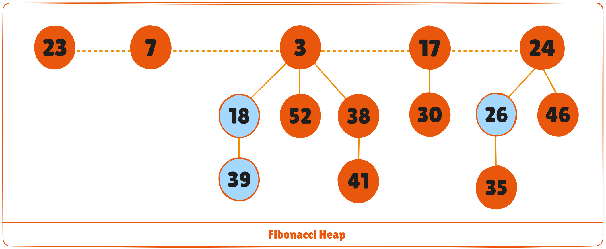
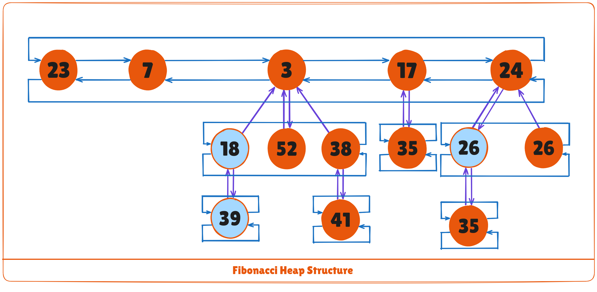
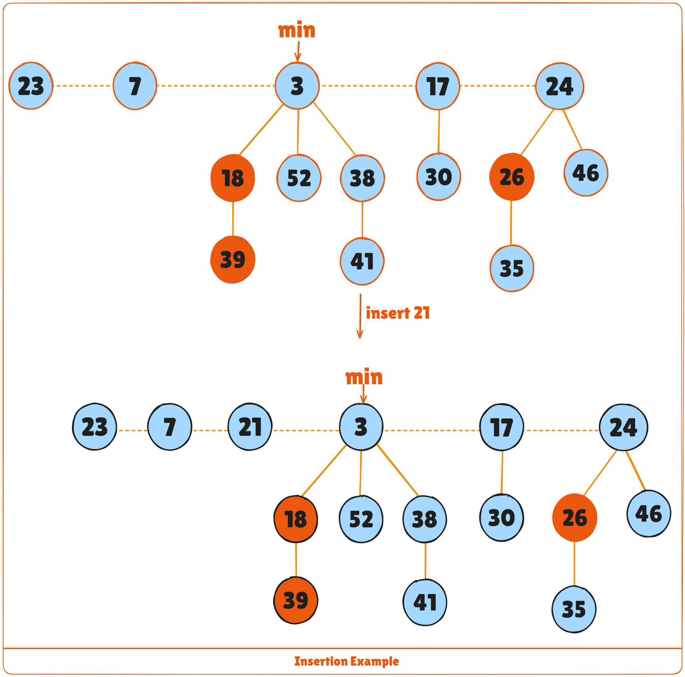
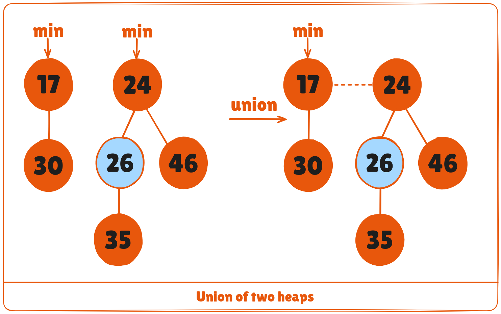
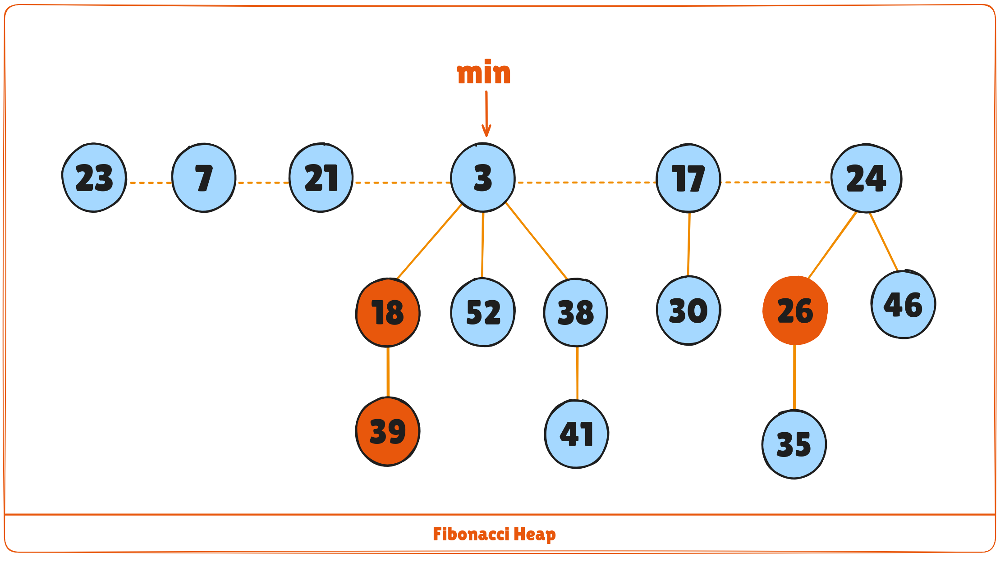

A fibonacci heap is a data structure that consists of a collection of trees which follow min heap or max heap property. We have already discussed **min heap** and **max heap property** in the Heap Data Structure article. These two properties are the characteristics of the trees present on a fibonacci heap.

In a fibonacci heap, a node can have more than two children or no children at all. Also, it has more efficient heap operations than that supported by the binomial and binary heaps.

The fibonacci heap is called a fibonacci heap because the trees are constructed in a way such that a tree of order ```n``` has at least ```Fn+2``` nodes in it, where ```Fn+2``` is the ```(n + 2)^th``` Fibonacci number.



## Properties of a Fibonacci Heap
Important properties of a Fibonacci heap are:

1. It is a set of **min heap-ordered** trees. (i.e. The parent is always smaller than the children.)
2. A pointer is maintained at the minimum element node.
3. It consists of a set of marked nodes. (Decrease key operation)
4. The trees within a Fibonacci heap are unordered but rooted.

## Memory Representation of the Nodes in a Fibonacci Heap
The roots of all the trees are linked together for faster access. The child nodes of a parent node are connected to each other through a circular doubly linked list as shown below.

There are two main advantages of using a circular doubly linked list.

1. Deleting a node from the tree takes ```O(1)``` time.
2. The concatenation of two such lists takes ```O(1)``` time.



## Operations on a Fibonacci Heap
### Insertion
**Algorithm**
```
insert(H, x)
    degree[x] = 0
    p[x] = NIL
    child[x] = NIL
    left[x] = x
    right[x] = x
    mark[x] = FALSE
    concatenate the root list containing x with root list H 
    if min[H] == NIL or key[x] < key[min[H]]
        then min[H] = x
    n[H] = n[H] + 1
```

Inserting a node into an already existing heap follows the steps below.

1. Create a new node for the element.
2. Check if the heap is empty.
3. If the heap is empty, set the new node as a root node and mark it **min**.
4. Else, insert the node into the root list and update **min**.



## Find Min
The minimum element is always given by the ```min``` pointer.

### Union
Union of two fibonacci heaps consists of following steps.

1. Concatenate the roots of both the heaps.
2. Update **min** by selecting a minimum key from the new root lists.



## Extract Min
It is the most important operation on a fibonacci heap. In this operation, the node with minimum value is removed from the heap and the tree is re-adjusted.

The following steps are followed:
1. Delete the min node.
2. Set the min-pointer to the next root in the root list.
3. Create an array of size equal to the maximum degree of the trees in the heap before deletion.
4. Do the following (steps 5-7) until there are no multiple roots with the same degree.
5. Map the degree of current root (min-pointer) to the degree in the array.
6. Map the degree of next root to the degree in array.
7. If there are more than two mappings for the same degree, then apply union operation to those roots such that the min-heap property is maintained (i.e. the minimum is at the root).

An implementation of the above steps can be understood in the example below.

1. We will perform an extract-min operation on the heap below.



2. Delete the min node, add all its child nodes to the root list and set the min-pointer to the next root in the root list.
