Heap data structure is a complete binary tree that satisfies **the heap property**, where any given node is

* Always greater than its child node/s and the key of the root node is the largest among all other nodes. This property is also called **max heap property**.
* Always smaller than the child node/s and the key of the root node is the smallest among all other nodes. This property is also called **min heap property**.

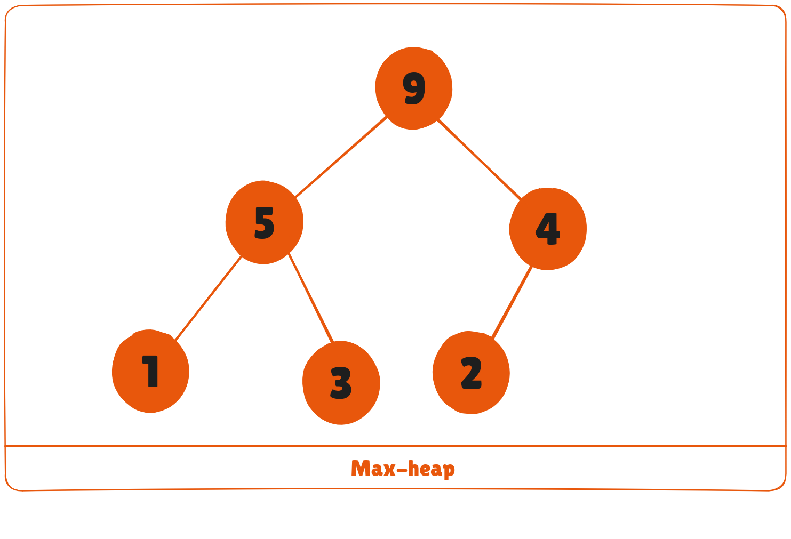

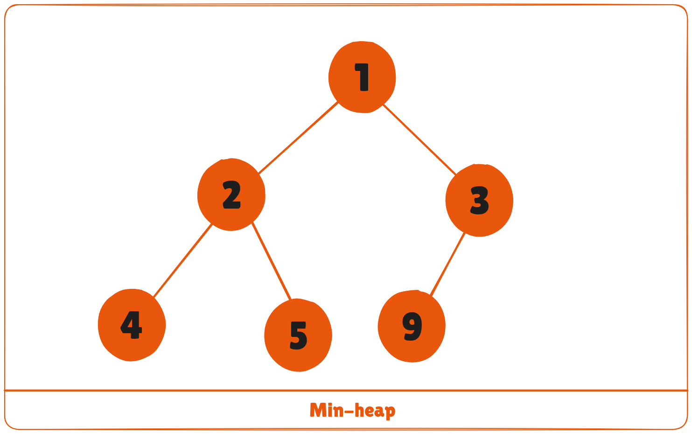

This type of data structure is also called a **binary heap**.

## Heap Operations
Some of the important operations performed on a heap are described below along with their algorithms.

### Heapify
Heapify is the process of creating a heap data structure from a binary tree. It is used to create a Min-Heap or a Max-Heap.

1. Let the input array be

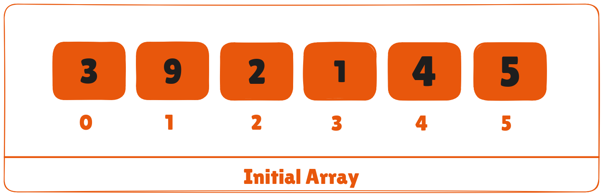

2. Create a complete binary tree from the array

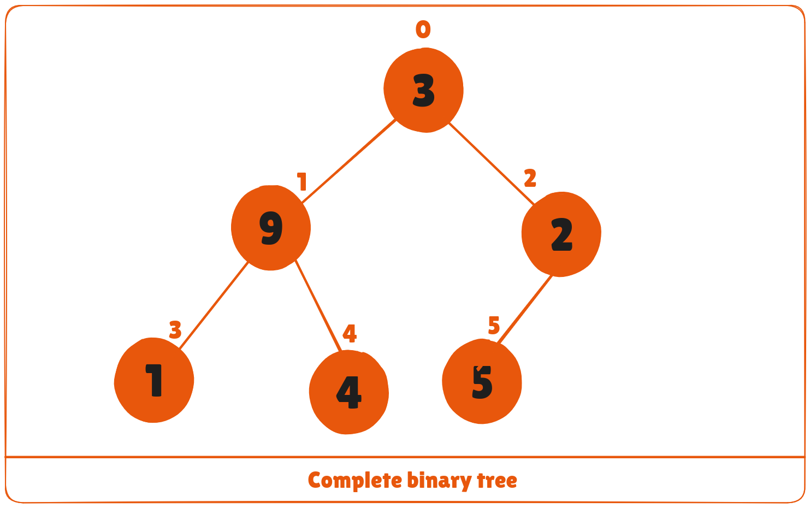

3. Start from the first index of non-leaf node whose index is given by ```n/2 - 1```.

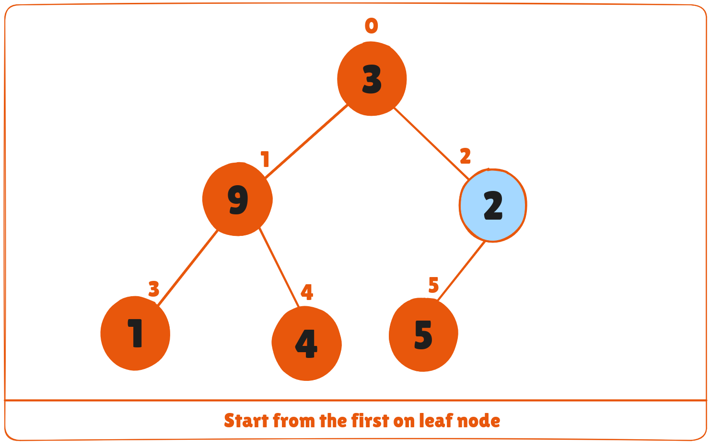

4. Set current element ```i``` as ```largest```.
5. The index of left child is given by ```2i + 1``` and the right child is given by ```2i + 2```.
If ```leftChild``` is greater than ```currentElement``` (i.e. element at ```ith``` index), set ```leftChildIndex``` as largest.
If ```rightChild``` is greater than element in ```largest```, set ```rightChildIndex``` as ```largest```.
6. Swap ```largest``` with ```currentElement```

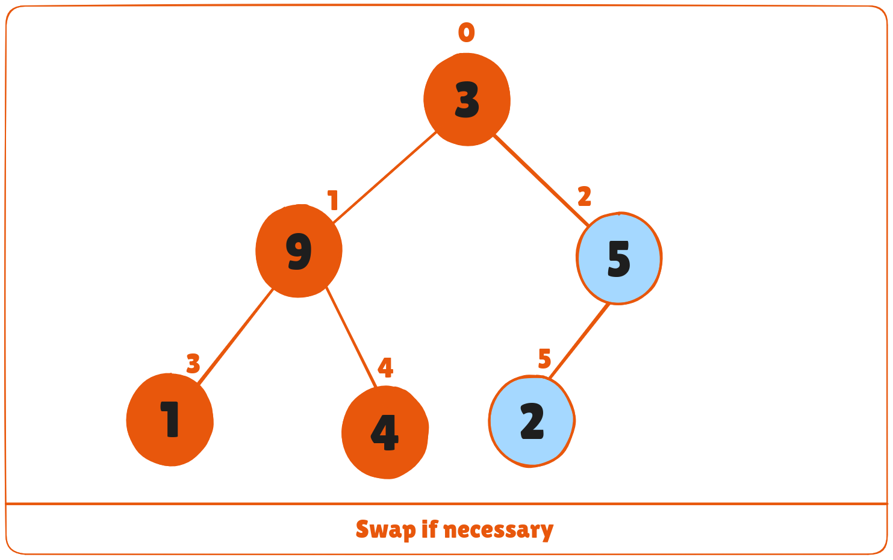

7. Repeat steps 3-7 until the subtrees are also heapified.

**Algorithm**

```bash
Heapify(array, size, i)
  set i as largest
  leftChild = 2i + 1
  rightChild = 2i + 2
  
  if leftChild > array[largest]
    set leftChildIndex as largest
  if rightChild > array[largest]
    set rightChildIndex as largest

  swap array[i] and array[largest]
```

To create a Max-Heap:

```bash
MaxHeap(array, size)
  loop from the first index of non-leaf node down to zero
    call heapify
```

For Min-Heap, both **leftChild** and **rightChild** must be larger than the parent for all nodes.

## Insert Element into Heap
Algorithm for insertion in Max Heap

```bash
If there is no node, 
  create a newNode.
else (a node is already present)
  insert the newNode at the end (last node from left to right.)
  
heapify the array
```

1. Insert the new element at the end of the tree.

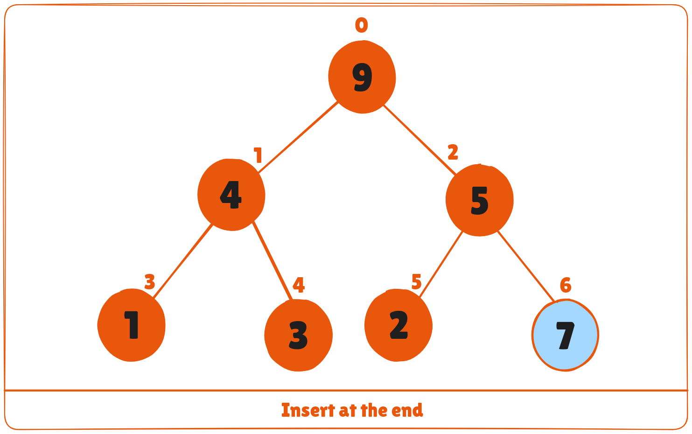

2. Heapify the tree.


For Min Heap, the above algorithm is modified so that ```parentNode``` is always smaller than ```newNode```.

## Delete Element from Heap
Algorithm for deletion in Max Heap

```bash
If nodeToBeDeleted is the leafNode
  remove the node
Else swap nodeToBeDeleted with the lastLeafNode
  remove noteToBeDeleted
   
heapify the array
```

1. Select the element to be deleted.

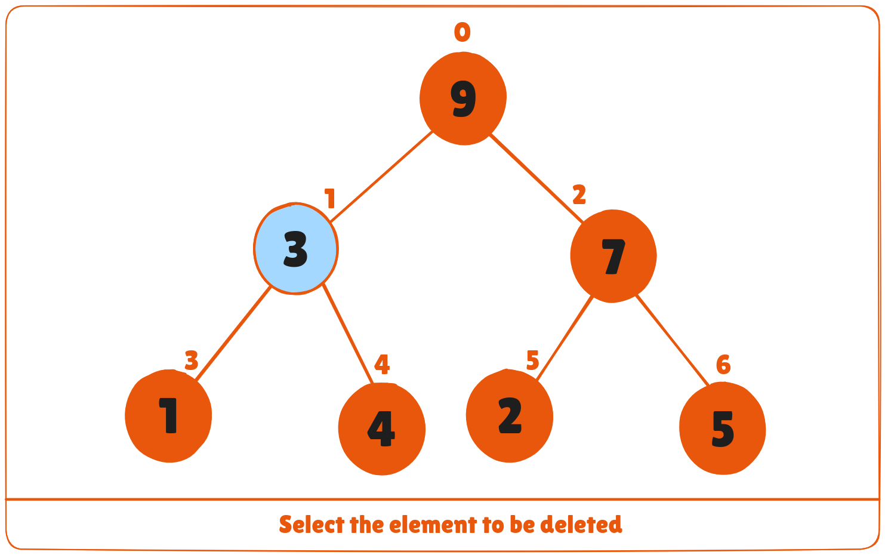

2. Swap it with the last element.

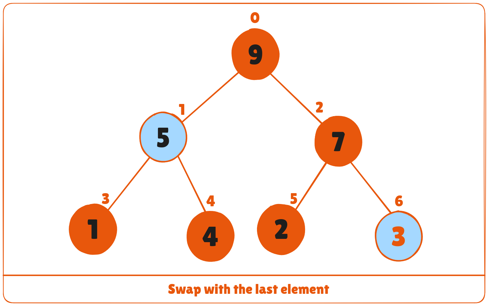

3. Remove the last element.

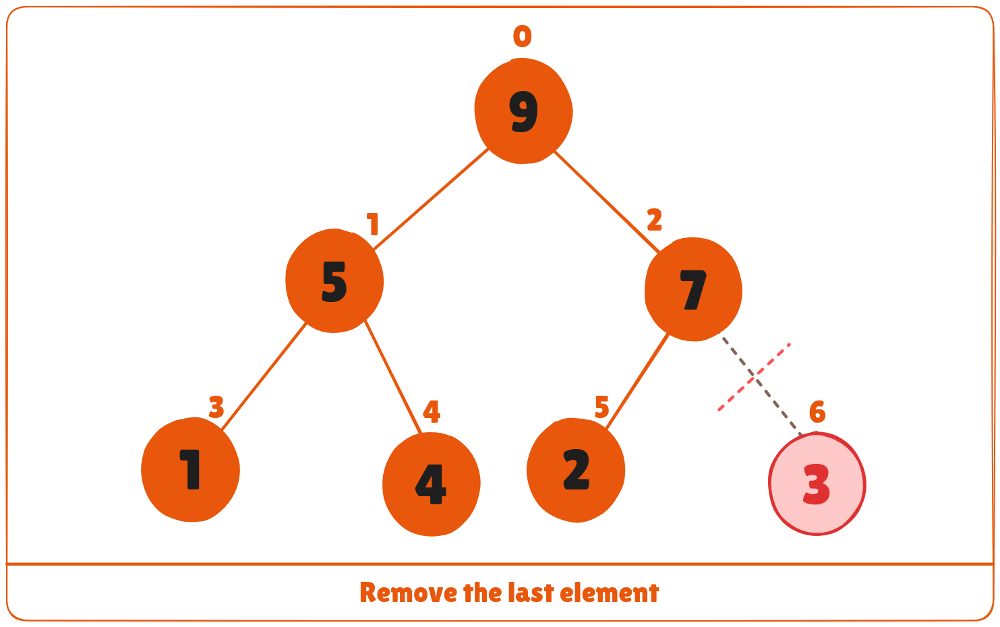

4. Heapify the tree.

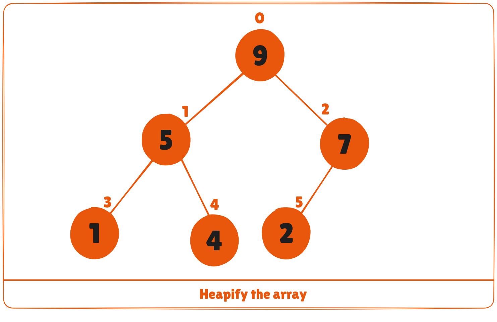

For Min Heap, above algorithm is modified so that both childNodes are greater smaller than ```currentNode```.

## Peek (Find max/min)
Peek operation returns the maximum element from Max Heap or minimum element from Min Heap without deleting the node.

For both Max heap and Min Heap

```text
return rootNode
```

## Extract-Max/Min
Extract-Max returns the node with maximum value after removing it from a Max Heap whereas Extract-Min returns the node with minimum after removing it from Min Heap.

## Python, Java, C/C++ Examples

<CodeGroup>

```python Python
# Max-Heap data structure in Python
def heapify(arr, n, i):
    largest = i
    l = 2 * i + 1
    r = 2 * i + 2
    
    if l < n and arr[l] > arr[largest]:
        largest = l
    
    if r < n and arr[r] > arr[largest]:
        largest = r
    
    if largest != i:
        arr[i], arr[largest] = arr[largest], arr[i]
        heapify(arr, n, largest)

def insert(array, newNum):
    array.append(newNum)
    current = len(array) - 1
    while current > 0:
        parent = (current - 1) // 2
        if array[current] > array[parent]:
            array[current], array[parent] = array[parent], array[current]
            current = parent
        else:
            break

def deleteNode(array, num):
    size = len(array)
    i = 0
    for i in range(size):
        if array[i] == num:
            break

    # Swap with the last element
    array[i], array[-1] = array[-1], array[i]
    array.pop()  # Remove the last element which is now the number to be deleted

    # Only run heapify if the deleted node was not the last node
    if i < len(array):
        heapify(array, len(array), i)

arr = []

insert(arr, 3)
insert(arr, 4)
insert(arr, 9)
insert(arr, 5)
insert(arr, 2)

print("Max-Heap array:", arr)

deleteNode(arr, 4)
print("After deleting an element:", arr)

```

```java Java
// Max-Heap data structure in Java

import java.util.ArrayList;

class Heap {
  void heapify(ArrayList<Integer> hT, int i) {
    int size = hT.size();
    int largest = i;
    int l = 2 * i + 1;
    int r = 2 * i + 2;
    if (l < size && hT.get(l) > hT.get(largest))
      largest = l;
    if (r < size && hT.get(r) > hT.get(largest))
      largest = r;

    if (largest != i) {
      int temp = hT.get(largest);
      hT.set(largest, hT.get(i));
      hT.set(i, temp);

      heapify(hT, largest);
    }
  }

  void insert(ArrayList<Integer> hT, int newNum) {
    int size = hT.size();
    if (size == 0) {
      hT.add(newNum);
    } else {
      hT.add(newNum);
      for (int i = size / 2 - 1; i >= 0; i--) {
        heapify(hT, i);
      }
    }
  }

  void deleteNode(ArrayList<Integer> hT, int num)
  {
    int size = hT.size();
    int i;
    for (i = 0; i < size; i++)
    {
      if (num == hT.get(i))
        break;
    }

    int temp = hT.get(i);
    hT.set(i, hT.get(size-1));
    hT.set(size-1, temp);

    hT.remove(size-1);
    for (int j = size / 2 - 1; j >= 0; j--)
    {
      heapify(hT, j);
    }
  }

  void printArray(ArrayList<Integer> array, int size) {
    for (Integer i : array) {
      System.out.print(i + " ");
    }
    System.out.println();
  }

  public static void main(String args[]) {

    ArrayList<Integer> array = new ArrayList<Integer>();
    int size = array.size();

    Heap h = new Heap();
    h.insert(array, 3);
    h.insert(array, 4);
    h.insert(array, 9);
    h.insert(array, 5);
    h.insert(array, 2);

    System.out.println("Max-Heap array: ");
    h.printArray(array, size);

    h.deleteNode(array, 4);
    System.out.println("After deleting an element: ");
    h.printArray(array, size);
  }
}
```

```c C
// Max-Heap data structure in C
#include <stdio.h>

int size = 0;

void swap(int *a, int *b) {
    int temp = *a;
    *a = *b;
    *b = temp;
}

void heapify(int array[], int size, int i) {
    int largest = i;
    int l = 2 * i + 1;
    int r = 2 * i + 2;

    if (l < size && array[l] > array[largest])
        largest = l;
    if (r < size && array[r] > array[largest])
        largest = r;

    if (largest != i) {
        swap(&array[i], &array[largest]);
        heapify(array, size, largest);
    }
}

void insert(int array[], int newNum) {
    array[size] = newNum;
    size += 1;

    int current = size - 1;
    while (current != 0) {
        int parent = (current - 1) / 2;
        if (array[current] > array[parent]) {
            swap(&array[current], &array[parent]);
            current = parent;
        } else {
            break;
        }
    }
}

void deleteRoot(int array[], int num) {
    int i;
    for (i = 0; i < size; i++) {
        if (array[i] == num) break;
    }

    swap(&array[i], &array[size - 1]);
    // Reduce the size of the heap since the last element is now removed
    size -= 1;

    // Heapify from the current index to adjust the rest of the heap
    if (i < size) {
        heapify(array, size, i);
    }
}

void printArray(int array[], int size) {
    for (int i = 0; i < size; ++i)
        printf("%d ", array[i]);
    printf("\n");
}

int main() {
    int array[10];

    insert(array, 3);
    insert(array, 4);
    insert(array, 9);
    insert(array, 5);
    insert(array, 2);

    printf("Max-Heap array: ");
    printArray(array, size);

    deleteRoot(array, 4);
    printf("After deleting an element: ");
    printArray(array, size);

    return 0;
}
```

```c C++
// Max-Heap data structure in C++
#include <iostream>
#include <vector>
using namespace std;

void swap(int *a, int *b) {
    int temp = *a;
    *a = *b;
    *b = temp;
}

void heapify(vector<int> &hT, int i) {
    int size = hT.size();
    int largest = i;
    int l = 2 * i + 1;
    int r = 2 * i + 2;
    if (l < size && hT[l] > hT[largest])
        largest = l;
    if (r < size && hT[r] > hT[largest])
        largest = r;

    if (largest != i) {
        swap(&hT[i], &hT[largest]);
        heapify(hT, largest);
    }
}

void insert(vector<int> &hT, int newNum) {
    hT.push_back(newNum);
    int current = hT.size() - 1;

    // Bubble up
    while (current > 0) {
        int parent = (current - 1) / 2;
        if (hT[current] > hT[parent]) {
            swap(&hT[current], &hT[parent]);
            current = parent;
        } else {
            break;
        }
    }
}

void deleteNode(vector<int> &hT, int num) {
    int size = hT.size();
    int i;
    for (i = 0; i < size; i++) {
        if (num == hT[i])
            break;
    }

    swap(&hT[i], &hT[size - 1]);
    hT.pop_back();
    // Update size after popping
    size = hT.size();  

    // Heapify from the current index to adjust the rest of the heap
    if (i < size) {
        heapify(hT, i);
    }
}

void printArray(const vector<int> &hT) {
    for (int num : hT)
        cout << num << " ";
    cout << "\n";
}

int main() {
    vector<int> heapTree;

    insert(heapTree, 3);
    insert(heapTree, 4);
    insert(heapTree, 9);
    insert(heapTree, 5);
    insert(heapTree, 2);

    cout << "Max-Heap array: ";
    printArray(heapTree);

    deleteNode(heapTree, 4);
    cout << "After deleting an element: ";
    printArray(heapTree);

    return 0;
}
```
</CodeGroup>

## Heap Data Structure Applications
* Heap is used while implementing a priority queue.
* Dijkstra's Algorithm
* Heap Sort