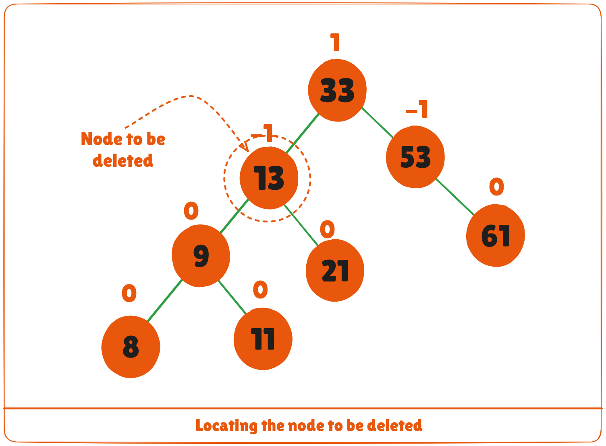
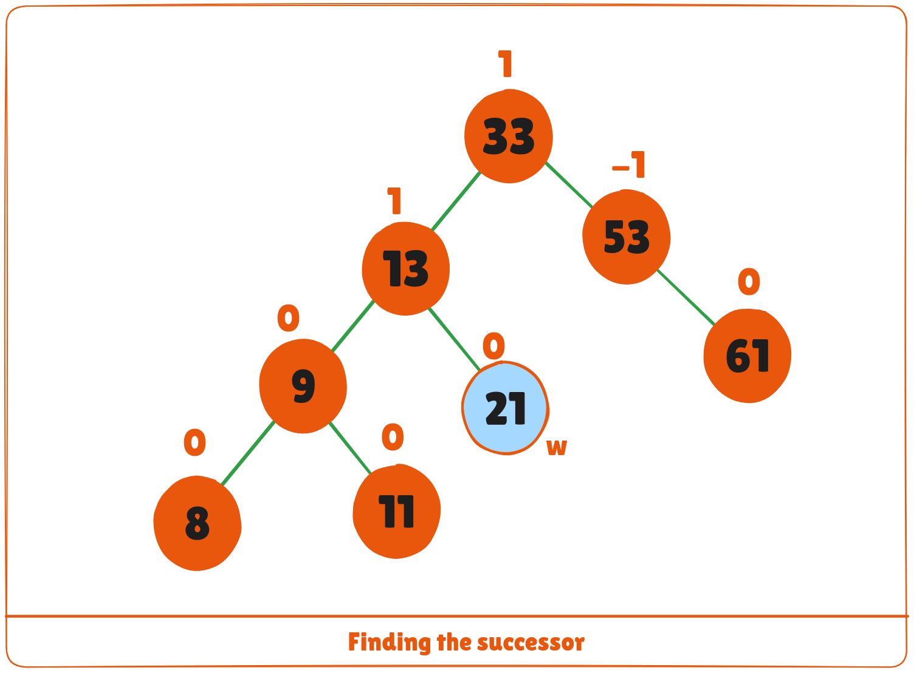
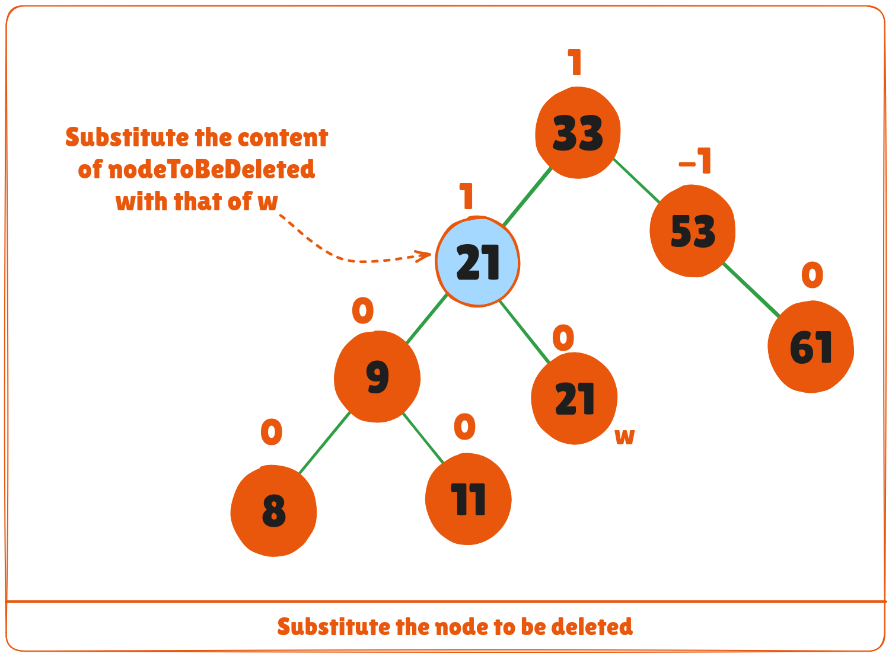
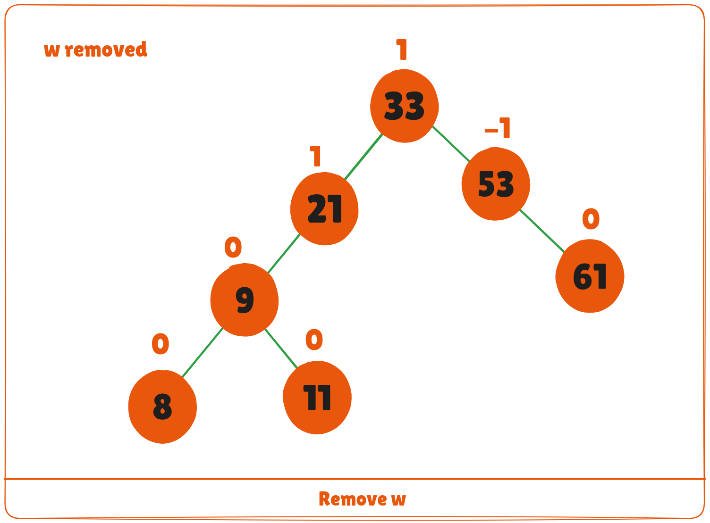
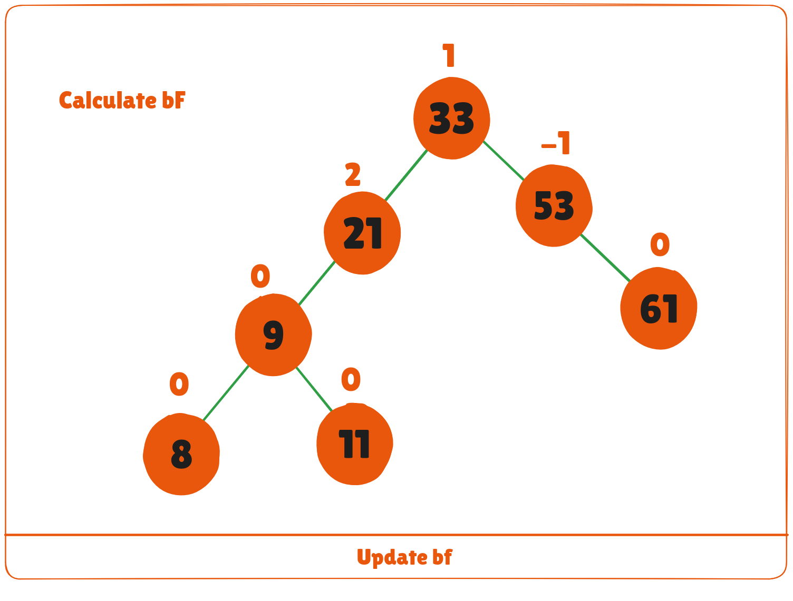
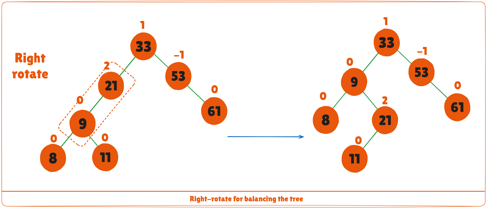
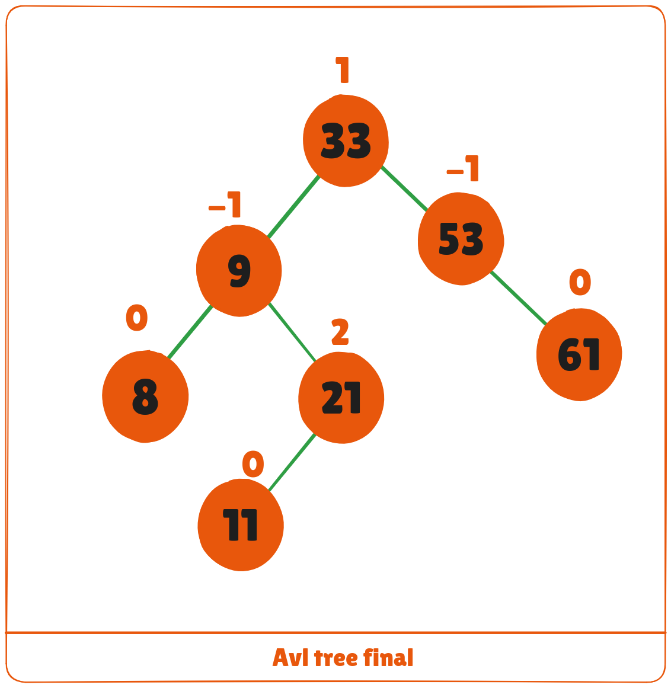

AVL tree is a self-balancing binary search tree in which each node maintains extra information called a balance factor whose value is either -1, 0 or +1.

AVL tree got its name after its inventor Georgy Adelson-Velsky and Landis.

## Balance Factor
Balance factor of a node in an AVL tree is the difference between the height of the left subtree and that of the right subtree of that node.

Balance Factor = (Height of Left Subtree - Height of Right Subtree) or (Height of Right Subtree - Height of Left Subtree)

The self balancing property of an avl tree is maintained by the balance factor. The value of balance factor should always be -1, 0 or +1.

An example of a balanced avl tree is:


## Operations on an AVL tree
Various operations that can be performed on an AVL tree are:

## Rotating the subtrees in an AVL Tree
In rotation operation, the positions of the nodes of a subtree are interchanged.

There are two types of rotations:

### Left Rotate
In left-rotation, the arrangement of the nodes on the right is transformed into the arrangements on the left node.

**Algorithm**

1. Let the initial tree be:


2. If ```y``` has a left subtree, assign ```x``` as the parent of the left subtree of ```y```.


3. If the parent of ```x``` is ```NULL```, make ```y``` as the root of the tree.
4. Else if ```x``` is the left child of ```p```, make ```y``` as the left child of ```p```.
5. Else assign ```y``` as the right child of ```p```.


6. Make ```y``` as the parent of ```x```.


### Right Rotate
In right-rotation, the arrangement of the nodes on the left is transformed into the arrangements on the right node.

1. Let the initial tree be:


2. If ```x``` has a right subtree, assign ```y``` as the parent of the right subtree of ```x```.
 


3. If the parent of ```y``` is ```NULL```, make ```x``` as the root of the tree.
4. Else if ```y``` is the right child of its parent ```p```, make ```x``` as the right child of ```p```.
5. Else assign ```x``` as the left child of ```p```.


6. Make ```x``` as the parent of ```y```.


## Left-Right and Right-Left Rotate
In left-right rotation, the arrangements are first shifted to the left and then to the right.

1. Do left rotation on ```x```-```y```.


2 . Do right rotation on y-z.


In right-left rotation, the arrangements are first shifted to the right and then to the left.

1. Do right rotation on x-y.


2. Do left rotation on z-y.


## Algorithm to insert a newNode
A ```newNode``` is always inserted as a leaf node with balance factor equal to 0.

1. Let the initial tree be:


Let the node to be inserted be:


1. Go to the appropriate leaf node to insert a ```newNode``` using the following recursive steps. Compare ```newKey``` with ```rootKey``` of the current tree.
2. If ```newKey``` < ```rootKey```, call insertion algorithm on the left subtree of the current node until the leaf node is reached.
3. Else if ```newKey``` > ```rootKey```, call insertion algorithm on the right subtree of current node until the leaf node is reached.
4. Else, return ```leafNode```.


3. Compare ```leafKey``` obtained from the above steps with ```newKey```.:

    a. If ```newKey``` < ```leafKey```, make ```newNode``` as the left child of ```leafNode```.

    b. Else, make ```newNode``` as the right child of ```leafNode```.


4. Update ```balanceFactor``` of the nodes.


5. If the nodes are unbalanced, then rebalance the node.

    a. If balanceFactor > 1, it means the height of the left subtree is greater than that of the right subtree. So, do a right rotation or left-right rotation

        a. If newNodeKey < leftChildKey do right rotation.

        b. Else, do left-right rotation.


    b. If ```balanceFactor``` < -1, it means the height of the right subtree is greater than that of the left subtree. So, do right rotation or right-left rotation.
        a. If ```newNodeKey``` > ```rightChildKey``` do left rotation.

        b. Else, do right-left rotation.

6. The final tree is:


## Algorithm to Delete a node
A node is always deleted as a leaf node. After deleting a node, the balance factors of the nodes get changed. In order to rebalance the balance factor, suitable rotations are performed.

1. Locate ```nodeToBeDeleted``` (recursion is used to find ```nodeToBeDeleted``` in the code used below).



2. There are three cases for deleting a node:

    a. If ```nodeToBeDeleted``` is the leaf node (ie. does not have any child), then remove ```nodeToBeDeleted```.
    b. If ```nodeToBeDeleted``` has one child, then substitute the contents of ```nodeToBeDeleted``` with that of the child. Remove the child.
    c. If ```nodeToBeDeleted``` has two children, find the inorder successor ```w``` of ```nodeToBeDeleted``` (ie. node with a minimum value of key in the right subtree).



     a. Substitute the contents of ```nodeToBeDeleted``` with that of ```w```.



      b. Remove the leaf node ```w```.



3. Update balanceFactor of the nodes.


4. Rebalance the tree if the balance factor of any of the nodes is not equal to -1, 0 or 1.

A. If ```balanceFactor``` of currentNode > 1,
    
     a. If ```balanceFactor``` of ```leftChild``` >= 0, do right rotation.




      b. Else, do left-right rotation.
B. If balanceFactor of currentNode < -1,
   a. If ```balanceFactor``` of ```rightChild``` ```<= 0```, do left rotation.
   b. Else do right-left rotation.

5. The final tree is:



## Python, Java and C/C++ Examples
<CodeGroup>

```python Python
# AVL tree implementation in Python
import sys

# Create a tree node
class TreeNode(object):
    def __init__(self, key):
        self.key = key
        self.left = None
        self.right = None
        self.height = 1

class AVLTree(object):
    # Function to insert a node
    def insert_node(self, root, key):
        # Find the correct location and insert the node
        if not root:
            return TreeNode(key)
        elif key < root.key:
            root.left = self.insert_node(root.left, key)
        else:
            root.right = self.insert_node(root.right, key)

        root.height = 1 + max(self.getHeight(root.left),
                              self.getHeight(root.right))

        # Update the balance factor and balance the tree
        balanceFactor = self.getBalance(root)
        if balanceFactor > 1:
            if key < root.left.key:
                return self.rightRotate(root)
            else:
                root.left = self.leftRotate(root.left)
                return self.rightRotate(root)

        if balanceFactor < -1:
            if key > root.right.key:
                return self.leftRotate(root)
            else:
                root.right = self.rightRotate(root.right)
                return self.leftRotate(root)

        return root

    # Function to delete a node
    def delete_node(self, root, key):
        # Find the node to be deleted and remove it
        if not root:
            return root
        elif key < root.key:
            root.left = self.delete_node(root.left, key)
        elif key > root.key:
            root.right = self.delete_node(root.right, key)
        else:
            if root.left is None:
                temp = root.right
                root = None
                return temp
            elif root.right is None:
                temp = root.left
                root = None
                return temp
            temp = self.getMinValueNode(root.right)
            root.key = temp.key
            root.right = self.delete_node(root.right,
                                          temp.key)
        if root is None:
            return root

        # Update the balance factor of nodes
        root.height = 1 + max(self.getHeight(root.left),
                              self.getHeight(root.right))

        balanceFactor = self.getBalance(root)

        # Balance the tree
        if balanceFactor > 1:
            if self.getBalance(root.left) >= 0:
                return self.rightRotate(root)
            else:
                root.left = self.leftRotate(root.left)
                return self.rightRotate(root)
        if balanceFactor < -1:
            if self.getBalance(root.right) <= 0:
                return self.leftRotate(root)
            else:
                root.right = self.rightRotate(root.right)
                return self.leftRotate(root)
        return root

    # Function to perform left rotation
    def leftRotate(self, z):
        y = z.right
        T2 = y.left
        y.left = z
        z.right = T2
        z.height = 1 + max(self.getHeight(z.left),
                           self.getHeight(z.right))
        y.height = 1 + max(self.getHeight(y.left),
                           self.getHeight(y.right))
        return y

    # Function to perform right rotation
    def rightRotate(self, z):
        y = z.left
        T3 = y.right
        y.right = z
        z.left = T3
        z.height = 1 + max(self.getHeight(z.left),
                           self.getHeight(z.right))
        y.height = 1 + max(self.getHeight(y.left),
                           self.getHeight(y.right))
        return y

    # Get the height of the node
    def getHeight(self, root):
        if not root:
            return 0
        return root.height

    # Get balance factore of the node
    def getBalance(self, root):
        if not root:
            return 0
        return self.getHeight(root.left) - self.getHeight(root.right)

    def getMinValueNode(self, root):
        if root is None or root.left is None:
            return root
        return self.getMinValueNode(root.left)

    def preOrder(self, root):
        if not root:
            return
        print("{0} ".format(root.key), end="")
        self.preOrder(root.left)
        self.preOrder(root.right)

    # Print the tree
    def printHelper(self, currPtr, indent, last):
        if currPtr != None:
            sys.stdout.write(indent)
            if last:
                sys.stdout.write("R----")
                indent += "     "
            else:
                sys.stdout.write("L----")
                indent += "|    "
            print(currPtr.key)
            self.printHelper(currPtr.left, indent, False)
            self.printHelper(currPtr.right, indent, True)

myTree = AVLTree()
root = None
nums = [33, 13, 52, 9, 21, 61, 8, 11]
for num in nums:
    root = myTree.insert_node(root, num)
myTree.printHelper(root, "", True)
key = 13
root = myTree.delete_node(root, key)
print("After Deletion: ")
myTree.printHelper(root, "", True)
```

```java Java
// AVL tree implementation in Java

// Create node
class Node {
  int item, height;
  Node left, right;

  Node(int d) {
    item = d;
    height = 1;
  }
}

// Tree class
class AVLTree {
  Node root;

  int height(Node N) {
    if (N == null)
      return 0;
    return N.height;
  }

  int max(int a, int b) {
    return (a > b) ? a : b;
  }

  Node rightRotate(Node y) {
    Node x = y.left;
    Node T2 = x.right;
    x.right = y;
    y.left = T2;
    y.height = max(height(y.left), height(y.right)) + 1;
    x.height = max(height(x.left), height(x.right)) + 1;
    return x;
  }

  Node leftRotate(Node x) {
    Node y = x.right;
    Node T2 = y.left;
    y.left = x;
    x.right = T2;
    x.height = max(height(x.left), height(x.right)) + 1;
    y.height = max(height(y.left), height(y.right)) + 1;
    return y;
  }

  // Get balance factor of a node
  int getBalanceFactor(Node N) {
    if (N == null)
      return 0;
    return height(N.left) - height(N.right);
  }

  // Insert a node
  Node insertNode(Node node, int item) {

    // Find the position and insert the node
    if (node == null)
      return (new Node(item));
    if (item < node.item)
      node.left = insertNode(node.left, item);
    else if (item > node.item)
      node.right = insertNode(node.right, item);
    else
      return node;

    // Update the balance factor of each node
    // And, balance the tree
    node.height = 1 + max(height(node.left), height(node.right));
    int balanceFactor = getBalanceFactor(node);
    if (balanceFactor > 1) {
      if (item < node.left.item) {
        return rightRotate(node);
      } else if (item > node.left.item) {
        node.left = leftRotate(node.left);
        return rightRotate(node);
      }
    }
    if (balanceFactor < -1) {
      if (item > node.right.item) {
        return leftRotate(node);
      } else if (item < node.right.item) {
        node.right = rightRotate(node.right);
        return leftRotate(node);
      }
    }
    return node;
  }

  Node nodeWithMimumValue(Node node) {
    Node current = node;
    while (current.left != null)
      current = current.left;
    return current;
  }

  // Delete a node
  Node deleteNode(Node root, int item) {

    // Find the node to be deleted and remove it
    if (root == null)
      return root;
    if (item < root.item)
      root.left = deleteNode(root.left, item);
    else if (item > root.item)
      root.right = deleteNode(root.right, item);
    else {
      if ((root.left == null) || (root.right == null)) {
        Node temp = null;
        if (temp == root.left)
          temp = root.right;
        else
          temp = root.left;
        if (temp == null) {
          temp = root;
          root = null;
        } else
          root = temp;
      } else {
        Node temp = nodeWithMimumValue(root.right);
        root.item = temp.item;
        root.right = deleteNode(root.right, temp.item);
      }
    }
    if (root == null)
      return root;

    // Update the balance factor of each node and balance the tree
    root.height = max(height(root.left), height(root.right)) + 1;
    int balanceFactor = getBalanceFactor(root);
    if (balanceFactor > 1) {
      if (getBalanceFactor(root.left) >= 0) {
        return rightRotate(root);
      } else {
        root.left = leftRotate(root.left);
        return rightRotate(root);
      }
    }
    if (balanceFactor < -1) {
      if (getBalanceFactor(root.right) <= 0) {
        return leftRotate(root);
      } else {
        root.right = rightRotate(root.right);
        return leftRotate(root);
      }
    }
    return root;
  }

  void preOrder(Node node) {
    if (node != null) {
      System.out.print(node.item + " ");
      preOrder(node.left);
      preOrder(node.right);
    }
  }

  // Print the tree
  private void printTree(Node currPtr, String indent, boolean last) {
    if (currPtr != null) {
      System.out.print(indent);
      if (last) {
        System.out.print("R----");
        indent += "   ";
      } else {
        System.out.print("L----");
        indent += "|  ";
      }
      System.out.println(currPtr.item);
      printTree(currPtr.left, indent, false);
      printTree(currPtr.right, indent, true);
    }
  }

  // Driver code
  public static void main(String[] args) {
    AVLTree tree = new AVLTree();
    tree.root = tree.insertNode(tree.root, 33);
    tree.root = tree.insertNode(tree.root, 13);
    tree.root = tree.insertNode(tree.root, 53);
    tree.root = tree.insertNode(tree.root, 9);
    tree.root = tree.insertNode(tree.root, 21);
    tree.root = tree.insertNode(tree.root, 61);
    tree.root = tree.insertNode(tree.root, 8);
    tree.root = tree.insertNode(tree.root, 11);
    tree.printTree(tree.root, "", true);
    tree.root = tree.deleteNode(tree.root, 13);
    System.out.println("After Deletion: ");
    tree.printTree(tree.root, "", true);
  }
}
```

```c C
// AVL tree implementation in C

#include <stdio.h>
#include <stdlib.h>

// Create Node
struct Node {
  int key;
  struct Node *left;
  struct Node *right;
  int height;
};

int max(int a, int b);

// Calculate height
int height(struct Node *N) {
  if (N == NULL)
    return 0;
  return N->height;
}

int max(int a, int b) {
  return (a > b) ? a : b;
}

// Create a node
struct Node *newNode(int key) {
  struct Node *node = (struct Node *)
    malloc(sizeof(struct Node));
  node->key = key;
  node->left = NULL;
  node->right = NULL;
  node->height = 1;
  return (node);
}

// Right rotate
struct Node *rightRotate(struct Node *y) {
  struct Node *x = y->left;
  struct Node *T2 = x->right;

  x->right = y;
  y->left = T2;

  y->height = max(height(y->left), height(y->right)) + 1;
  x->height = max(height(x->left), height(x->right)) + 1;

  return x;
}

// Left rotate
struct Node *leftRotate(struct Node *x) {
  struct Node *y = x->right;
  struct Node *T2 = y->left;

  y->left = x;
  x->right = T2;

  x->height = max(height(x->left), height(x->right)) + 1;
  y->height = max(height(y->left), height(y->right)) + 1;

  return y;
}

// Get the balance factor
int getBalance(struct Node *N) {
  if (N == NULL)
    return 0;
  return height(N->left) - height(N->right);
}

// Insert node
struct Node *insertNode(struct Node *node, int key) {
  // Find the correct position to insertNode the node and insertNode it
  if (node == NULL)
    return (newNode(key));

  if (key < node->key)
    node->left = insertNode(node->left, key);
  else if (key > node->key)
    node->right = insertNode(node->right, key);
  else
    return node;

  // Update the balance factor of each node and
  // Balance the tree
  node->height = 1 + max(height(node->left),
               height(node->right));

  int balance = getBalance(node);
  if (balance > 1 && key < node->left->key)
    return rightRotate(node);

  if (balance < -1 && key > node->right->key)
    return leftRotate(node);

  if (balance > 1 && key > node->left->key) {
    node->left = leftRotate(node->left);
    return rightRotate(node);
  }

  if (balance < -1 && key < node->right->key) {
    node->right = rightRotate(node->right);
    return leftRotate(node);
  }

  return node;
}

struct Node *minValueNode(struct Node *node) {
  struct Node *current = node;

  while (current->left != NULL)
    current = current->left;

  return current;
}

// Delete a nodes
struct Node *deleteNode(struct Node *root, int key) {
  // Find the node and delete it
  if (root == NULL)
    return root;

  if (key < root->key)
    root->left = deleteNode(root->left, key);

  else if (key > root->key)
    root->right = deleteNode(root->right, key);

  else {
    if ((root->left == NULL) || (root->right == NULL)) {
      struct Node *temp = root->left ? root->left : root->right;

      if (temp == NULL) {
        temp = root;
        root = NULL;
      } else
        *root = *temp;
      free(temp);
    } else {
      struct Node *temp = minValueNode(root->right);

      root->key = temp->key;

      root->right = deleteNode(root->right, temp->key);
    }
  }

  if (root == NULL)
    return root;

  // Update the balance factor of each node and
  // balance the tree
  root->height = 1 + max(height(root->left),
               height(root->right));

  int balance = getBalance(root);
  if (balance > 1 && getBalance(root->left) >= 0)
    return rightRotate(root);

  if (balance > 1 && getBalance(root->left) < 0) {
    root->left = leftRotate(root->left);
    return rightRotate(root);
  }

  if (balance < -1 && getBalance(root->right) <= 0)
    return leftRotate(root);

  if (balance < -1 && getBalance(root->right) > 0) {
    root->right = rightRotate(root->right);
    return leftRotate(root);
  }

  return root;
}

// Print the tree
void printPreOrder(struct Node *root) {
  if (root != NULL) {
    printf("%d ", root->key);
    printPreOrder(root->left);
    printPreOrder(root->right);
  }
}

int main() {
  struct Node *root = NULL;

  root = insertNode(root, 2);
  root = insertNode(root, 1);
  root = insertNode(root, 7);
  root = insertNode(root, 4);
  root = insertNode(root, 5);
  root = insertNode(root, 3);
  root = insertNode(root, 8);

  printPreOrder(root);

  root = deleteNode(root, 3);

  printf("\nAfter deletion: ");
  printPreOrder(root);

  return 0;
}
```

```cpp C++
// AVL tree implementation in C++

#include <iostream>
using namespace std;

class Node {
   public:
  int key;
  Node *left;
  Node *right;
  int height;
};

int max(int a, int b);

// Calculate height
int height(Node *N) {
  if (N == NULL)
    return 0;
  return N->height;
}

int max(int a, int b) {
  return (a > b) ? a : b;
}

// New node creation
Node *newNode(int key) {
  Node *node = new Node();
  node->key = key;
  node->left = NULL;
  node->right = NULL;
  node->height = 1;
  return (node);
}

// Rotate right
Node *rightRotate(Node *y) {
  Node *x = y->left;
  Node *T2 = x->right;
  x->right = y;
  y->left = T2;
  y->height = max(height(y->left),
          height(y->right)) +
        1;
  x->height = max(height(x->left),
          height(x->right)) +
        1;
  return x;
}

// Rotate left
Node *leftRotate(Node *x) {
  Node *y = x->right;
  Node *T2 = y->left;
  y->left = x;
  x->right = T2;
  x->height = max(height(x->left),
          height(x->right)) +
        1;
  y->height = max(height(y->left),
          height(y->right)) +
        1;
  return y;
}

// Get the balance factor of each node
int getBalanceFactor(Node *N) {
  if (N == NULL)
    return 0;
  return height(N->left) -
       height(N->right);
}

// Insert a node
Node *insertNode(Node *node, int key) {
  // Find the correct postion and insert the node
  if (node == NULL)
    return (newNode(key));
  if (key < node->key)
    node->left = insertNode(node->left, key);
  else if (key > node->key)
    node->right = insertNode(node->right, key);
  else
    return node;

  // Update the balance factor of each node and
  // balance the tree
  node->height = 1 + max(height(node->left),
               height(node->right));
  int balanceFactor = getBalanceFactor(node);
  if (balanceFactor > 1) {
    if (key < node->left->key) {
      return rightRotate(node);
    } else if (key > node->left->key) {
      node->left = leftRotate(node->left);
      return rightRotate(node);
    }
  }
  if (balanceFactor < -1) {
    if (key > node->right->key) {
      return leftRotate(node);
    } else if (key < node->right->key) {
      node->right = rightRotate(node->right);
      return leftRotate(node);
    }
  }
  return node;
}

// Node with minimum value
Node *nodeWithMimumValue(Node *node) {
  Node *current = node;
  while (current->left != NULL)
    current = current->left;
  return current;
}

// Delete a node
Node *deleteNode(Node *root, int key) {
  // Find the node and delete it
  if (root == NULL)
    return root;
  if (key < root->key)
    root->left = deleteNode(root->left, key);
  else if (key > root->key)
    root->right = deleteNode(root->right, key);
  else {
    if ((root->left == NULL) ||
      (root->right == NULL)) {
      Node *temp = root->left ? root->left : root->right;
      if (temp == NULL) {
        temp = root;
        root = NULL;
      } else
        *root = *temp;
      free(temp);
    } else {
      Node *temp = nodeWithMimumValue(root->right);
      root->key = temp->key;
      root->right = deleteNode(root->right,
                   temp->key);
    }
  }

  if (root == NULL)
    return root;

  // Update the balance factor of each node and
  // balance the tree
  root->height = 1 + max(height(root->left),
               height(root->right));
  int balanceFactor = getBalanceFactor(root);
  if (balanceFactor > 1) {
    if (getBalanceFactor(root->left) >= 0) {
      return rightRotate(root);
    } else {
      root->left = leftRotate(root->left);
      return rightRotate(root);
    }
  }
  if (balanceFactor < -1) {
    if (getBalanceFactor(root->right) <= 0) {
      return leftRotate(root);
    } else {
      root->right = rightRotate(root->right);
      return leftRotate(root);
    }
  }
  return root;
}

// Print the tree
void printTree(Node *root, string indent, bool last) {
  if (root != nullptr) {
    cout << indent;
    if (last) {
      cout << "R----";
      indent += "   ";
    } else {
      cout << "L----";
      indent += "|  ";
    }
    cout << root->key << endl;
    printTree(root->left, indent, false);
    printTree(root->right, indent, true);
  }
}

int main() {
  Node *root = NULL;
  root = insertNode(root, 33);
  root = insertNode(root, 13);
  root = insertNode(root, 53);
  root = insertNode(root, 9);
  root = insertNode(root, 21);
  root = insertNode(root, 61);
  root = insertNode(root, 8);
  root = insertNode(root, 11);
  printTree(root, "", true);
  root = deleteNode(root, 13);
  cout << "After deleting " << endl;
  printTree(root, "", true);
}
```

</CodeGroup>

## Complexities of Different Operations on an AVL Tree
<Columns cols={3}>
  <Card title="Insertion">
    O(log n)	
  </Card>
  <Card title="Deletion">
    O(log n)	
  </Card>
  <Card title="Search">
    O(log n)
  </Card>
</Columns>

## AVL Tree Applications
* For indexing large records in databases
* For searching in large databases

