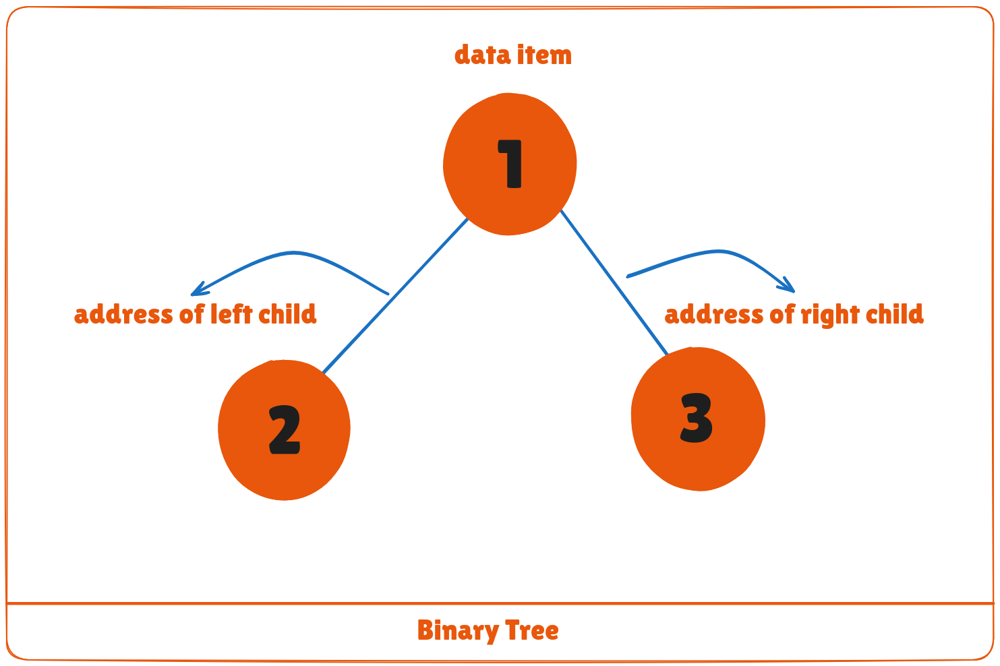
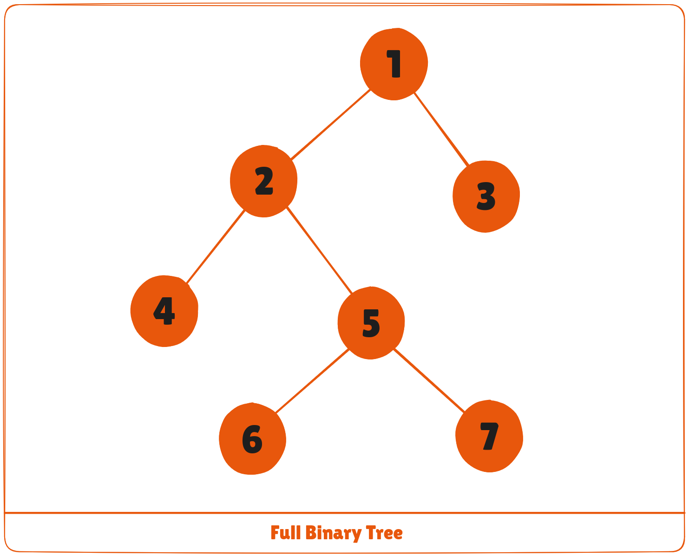
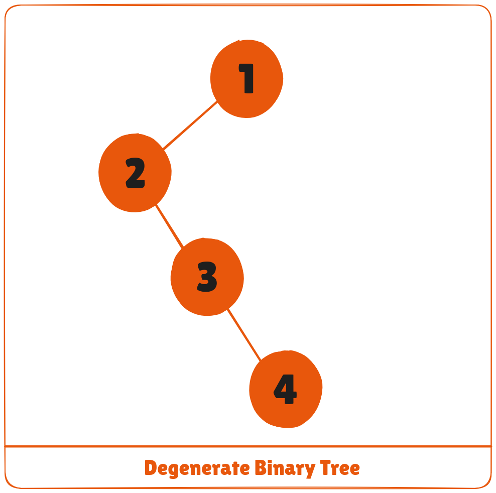
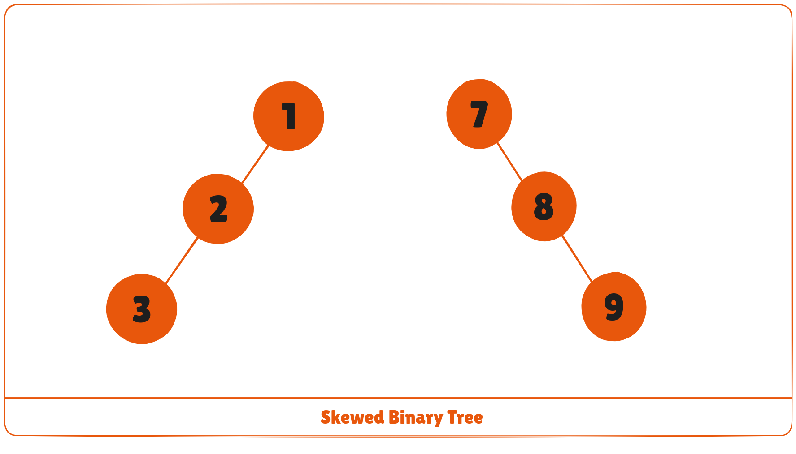
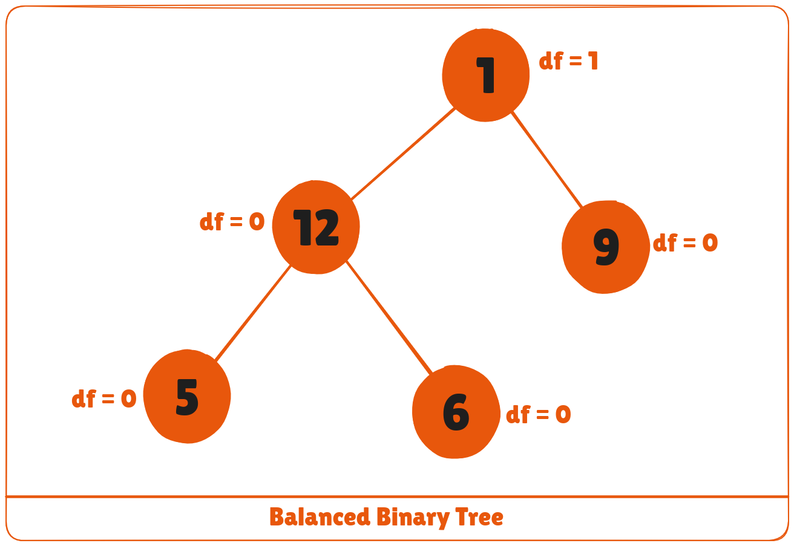
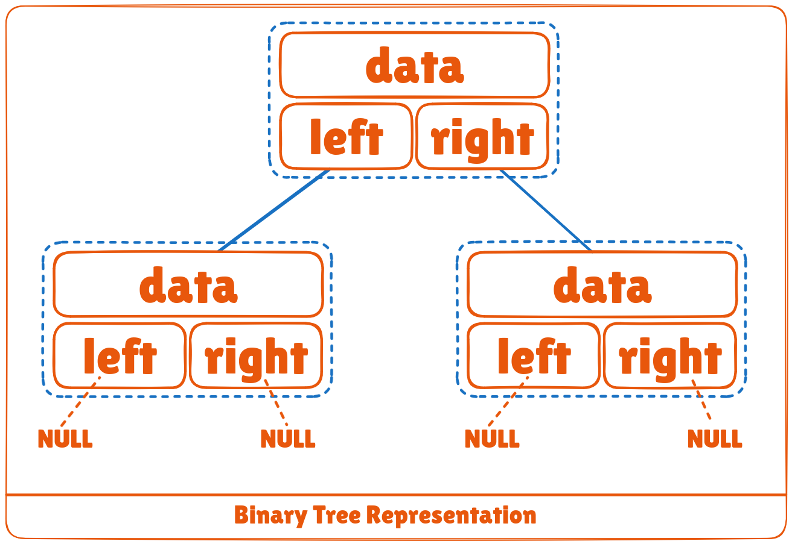

A binary tree is a tree data structure in which each parent node can have at most two children. Each node of a binary tree consists of three items:

* Data item
* Address of left child
* Address of right child



## Types of Binary Tree
### 1. Full Binary Tree
A full Binary tree is a special type of binary tree in which every parent node/internal node has either two or no children.




### 2. Perfect Binary Tree
A perfect binary tree is a type of binary tree in which every internal node has exactly two child nodes and all the leaf nodes are at the same level.


### 3. Complete Binary Tree
A complete binary tree is just like a full binary tree, but with two major differences

1. Every level must be completely filled
2. All the leaf elements must lean towards the left.
3. The last leaf element might not have a right sibling i.e. a complete binary tree doesn't have to be a full binary tree.


### 4. Degenerate or Pathological Tree
A degenerate or pathological tree is the tree having a single child either left or right.




### 5. Skewed Binary Tree
A skewed binary tree is a pathological/degenerate tree in which the tree is either dominated by the left nodes or the right nodes. Thus, there are two types of skewed binary tree: **left-skewed binary tree** and **right-skewed binary tree**.




### 6. Balanced Binary Tree
It is a type of binary tree in which the difference between the height of the left and the right subtree for each node is either 0 or 1.




## Binary Tree Representation
A node of a binary tree is represented by a structure containing a data part and two pointers to other structures of the same type.

```cpp
struct node
{
    int data;
 struct node *left;
 struct node *right;
};
```



## Python, Java and C/C++ Examples

<CodeGroup>

```python Python 
# Binary Tree in Python

class Node:
    def __init__(self, key):
        self.left = None
        self.right = None
        self.val = key

    # Traverse preorder
    def traversePreOrder(self):
        print(self.val, end=' ')
        if self.left:
            self.left.traversePreOrder()
        if self.right:
            self.right.traversePreOrder()

    # Traverse inorder
    def traverseInOrder(self):
        if self.left:
            self.left.traverseInOrder()
        print(self.val, end=' ')
        if self.right:
            self.right.traverseInOrder()

    # Traverse postorder
    def traversePostOrder(self):
        if self.left:
            self.left.traversePostOrder()
        if self.right:
            self.right.traversePostOrder()
        print(self.val, end=' ')

root = Node(1)

root.left = Node(2)
root.right = Node(3)

root.left.left = Node(4)

print("Pre order Traversal: ", end="")
root.traversePreOrder()
print("\nIn order Traversal: ", end="")
root.traverseInOrder()
print("\nPost order Traversal: ", end="")
root.traversePostOrder()
```

```java Java
// Binary Tree in Java

// Node creation
class Node {
  int key;
  Node left, right;

  public Node(int item) {
  key = item;
  left = right = null;
  }
}

class BinaryTree {
  Node root;

  BinaryTree(int key) {
  root = new Node(key);
  }

  BinaryTree() {
  root = null;
  }

  // Traverse Inorder
  public void traverseInOrder(Node node) {
  if (node != null) {
    traverseInOrder(node.left);
    System.out.print(" " + node.key);
    traverseInOrder(node.right);
  }
  }

  // Traverse Postorder
  public void traversePostOrder(Node node) {
  if (node != null) {
    traversePostOrder(node.left);
    traversePostOrder(node.right);
    System.out.print(" " + node.key);
  }
  }

  // Traverse Preorder
  public void traversePreOrder(Node node) {
  if (node != null) {
    System.out.print(" " + node.key);
    traversePreOrder(node.left);
    traversePreOrder(node.right);
  }
  }

  public static void main(String[] args) {
  BinaryTree tree = new BinaryTree();

  tree.root = new Node(1);
  tree.root.left = new Node(2);
  tree.root.right = new Node(3);
  tree.root.left.left = new Node(4);

  System.out.print("Pre order Traversal: ");
  tree.traversePreOrder(tree.root);
  System.out.print("\nIn order Traversal: ");
  tree.traverseInOrder(tree.root);
  System.out.print("\nPost order Traversal: ");
  tree.traversePostOrder(tree.root);
  }
}

```

```c C
// Tree traversal in C
#include <stdio.h>
#include <stdlib.h>

struct node {
  int item;
  struct node* left;
  struct node* right;
};

// Inorder traversal
void inorderTraversal(struct node* root) {
  if (root == NULL) return;
  inorderTraversal(root->left);
  printf("%d ->", root->item);
  inorderTraversal(root->right);
}

// Preorder traversal
void preorderTraversal(struct node* root) {
  if (root == NULL) return;
  printf("%d ->", root->item);
  preorderTraversal(root->left);
  preorderTraversal(root->right);
}

// Postorder traversal
void postorderTraversal(struct node* root) {
  if (root == NULL) return;
  postorderTraversal(root->left);
  postorderTraversal(root->right);
  printf("%d ->", root->item);
}

// Create a new Node
struct node* createNode(value) {
  struct node* newNode = malloc(sizeof(struct node));
  newNode->item = value;
  newNode->left = NULL;
  newNode->right = NULL;

  return newNode;
}

// Insert on the left of the node
struct node* insertLeft(struct node* root, int value) {
  root->left = createNode(value);
  return root->left;
}

// Insert on the right of the node
struct node* insertRight(struct node* root, int value) {
  root->right = createNode(value);
  return root->right;
}

int main() {
  struct node* root = createNode(1);
  insertLeft(root, 2);
  insertRight(root, 3);
  insertLeft(root->left, 4);

  printf("Inorder traversal \n");
  inorderTraversal(root);

  printf("\nPreorder traversal \n");
  preorderTraversal(root);

  printf("\nPostorder traversal \n");
  postorderTraversal(root);
}
```

```cpp C++
// Binary Tree in C++
#include <stdlib.h>
#include <iostream>
using namespace std;

struct node {
  int data;
  struct node *left;
  struct node *right;
};

// New node creation
struct node *newNode(int data) {
  struct node *node = (struct node *)malloc(sizeof(struct node));

  node->data = data;

  node->left = NULL;
  node->right = NULL;
  return (node);
}

// Traverse Preorder
void traversePreOrder(struct node *temp) {
  if (temp != NULL) {
    cout << " " << temp->data;
    traversePreOrder(temp->left);
    traversePreOrder(temp->right);
  }
}

// Traverse Inorder
void traverseInOrder(struct node *temp) {
  if (temp != NULL) {
    traverseInOrder(temp->left);
    cout << " " << temp->data;
    traverseInOrder(temp->right);
  }
}

// Traverse Postorder
void traversePostOrder(struct node *temp) {
  if (temp != NULL) {
    traversePostOrder(temp->left);
    traversePostOrder(temp->right);
    cout << " " << temp->data;
  }
}

int main() {
  struct node *root = newNode(1);
  root->left = newNode(2);
  root->right = newNode(3);
  root->left->left = newNode(4);

  cout << "preorder traversal: ";
  traversePreOrder(root);
  cout << "\nInorder traversal: ";
  traverseInOrder(root);
  cout << "\nPostorder traversal: ";
  traversePostOrder(root);
}
```

</CodeGroup>

## Binary Tree Applications
* For easy and quick access to data
* In router algorithms
* To implement heap data structure
* Syntax tree