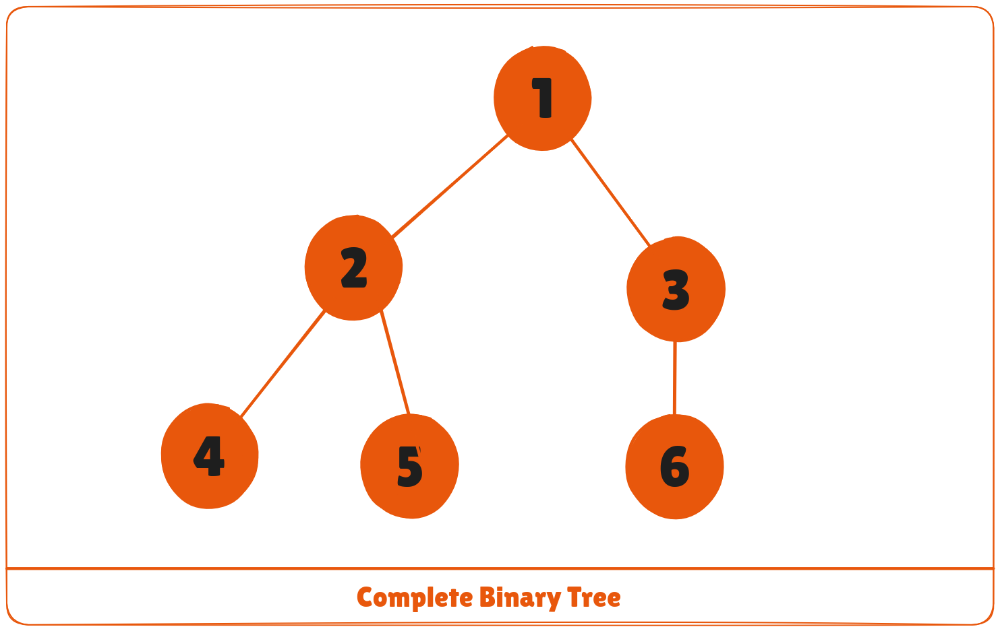
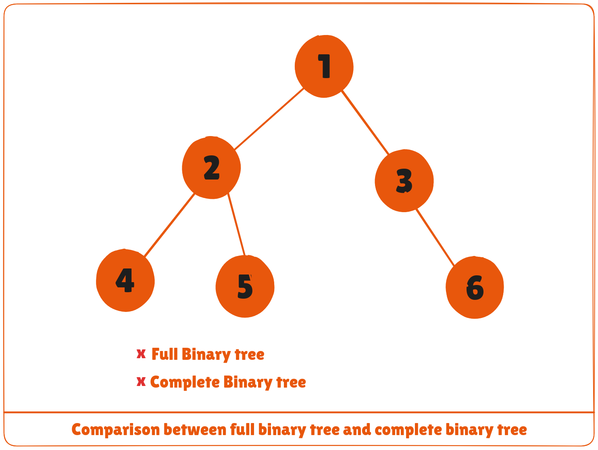
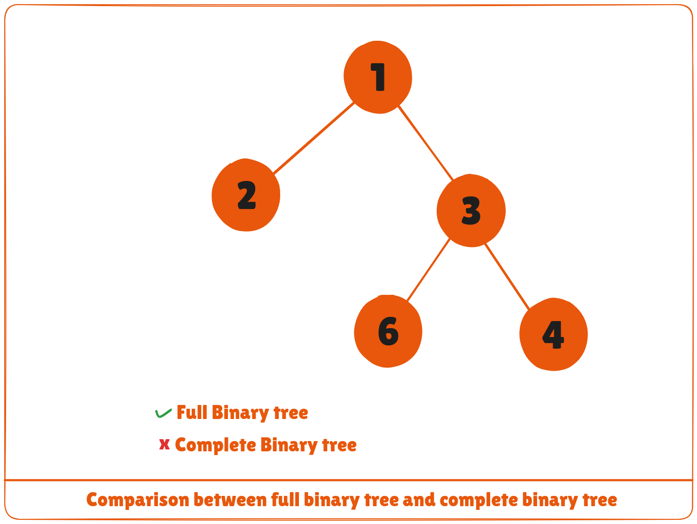
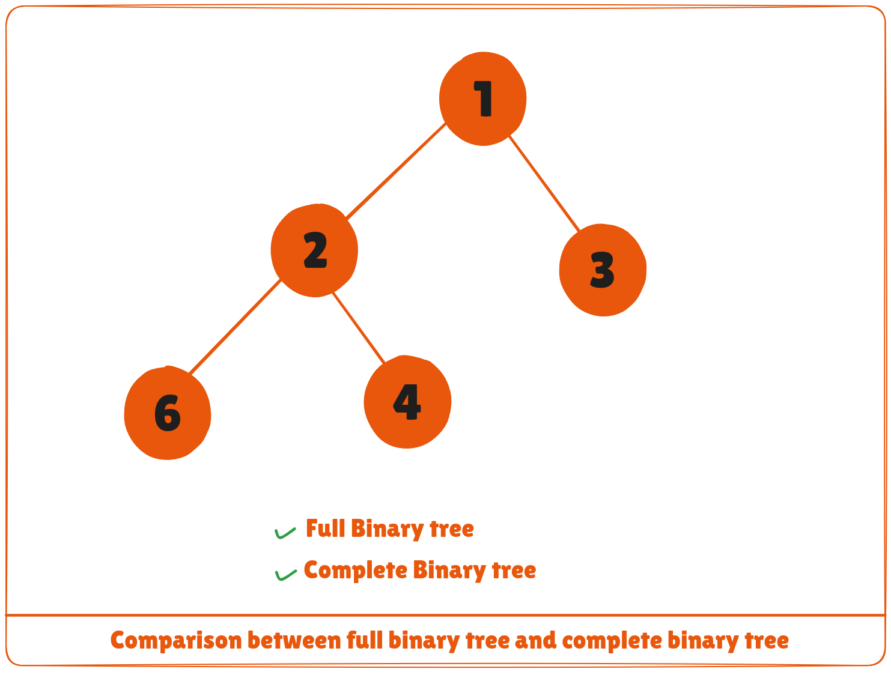
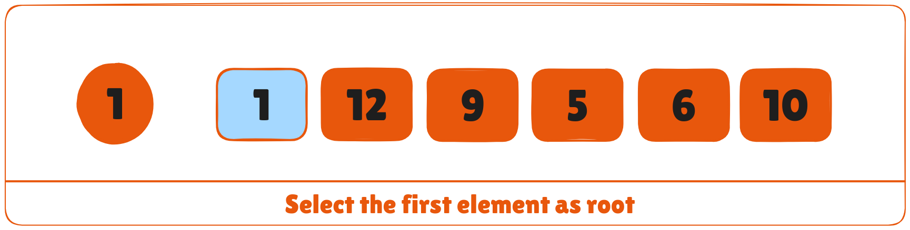
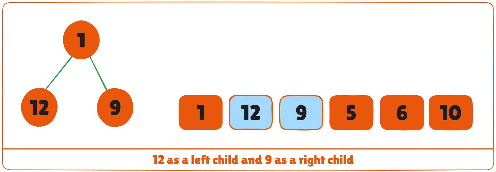
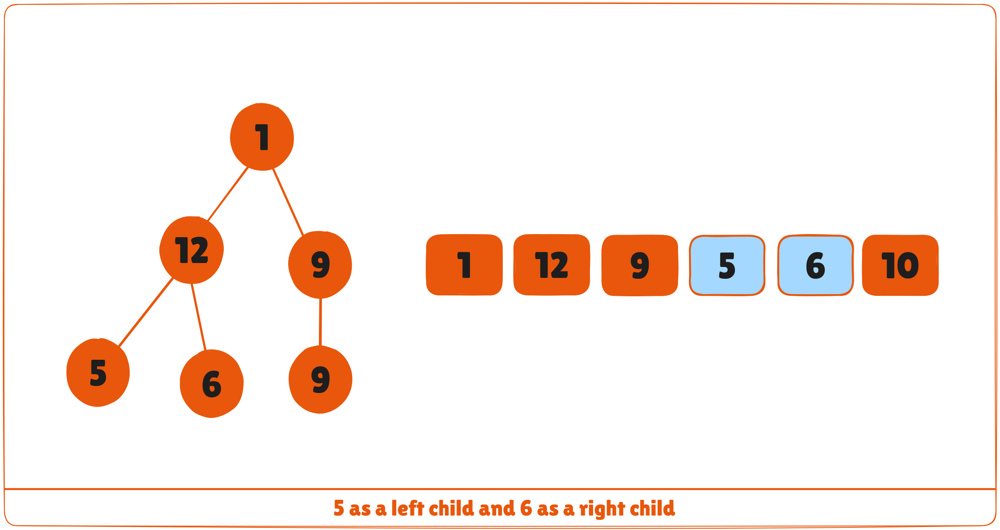

A complete binary tree is a binary tree in which all the levels are completely filled except possibly the lowest one, which is filled from the left.

A complete binary tree is just like a full binary tree, but with two major differences

1. All the leaf elements must lean towards the left.
2. The last leaf element might not have a right sibling i.e. a complete binary tree doesn't have to be a full binary tree.



## Full Binary Tree vs Complete Binary Tree








## How a Complete Binary Tree is Created?
1. Select the first element of the list to be the root node. (no. of elements on level-I: 1)




2. Put the second element as a left child of the root node and the third element as the right child. (no. of elements on level-II: 2)



1. Put the next two elements as children of the left node of the second level. Again, put the next two elements as children of the right node of the second level (no. of elements on level-III: 4) elements).
2. Keep repeating until you reach the last element.




## Python, Java and C/C++ Examples

<CodeGroup>

```python Python
# Checking if a binary tree is a complete binary tree in Python
class Node:

    def __init__(self, item):
        self.item = item
        self.left = None
        self.right = None

# Count the number of nodes
def count_nodes(root):
    if root is None:
        return 0
    return (1 + count_nodes(root.left) + count_nodes(root.right))

# Check if the tree is complete binary tree
def is_complete(root, index, numberNodes):

    # Check if the tree is empty
    if root is None:
        return True

    if index >= numberNodes:
        return False

    return (is_complete(root.left, 2 * index + 1, numberNodes)
            and is_complete(root.right, 2 * index + 2, numberNodes))

root = Node(1)
root.left = Node(2)
root.right = Node(3)
root.left.left = Node(4)
root.left.right = Node(5)
root.right.left = Node(6)

node_count = count_nodes(root)
index = 0

if is_complete(root, index, node_count):
    print("The tree is a complete binary tree")
else:
    print("The tree is not a complete binary tree")
```

```java Java
// Checking if a binary tree is a complete binary tree in Java
// Node creation
class Node {
  int data;
  Node left, right;

  Node(int item) {
    data = item;
    left = right = null;
  }
}

class BinaryTree {
  Node root;

  // Count the number of nodes
  int countNumNodes(Node root) {
    if (root == null)
      return (0);
    return (1 + countNumNodes(root.left) + countNumNodes(root.right));
  }

  // Check for complete binary tree
  boolean checkComplete(Node root, int index, int numberNodes) {

    // Check if the tree is empty
    if (root == null)
      return true;

    if (index >= numberNodes)
      return false;

    return (checkComplete(root.left, 2 * index + 1, numberNodes)
        && checkComplete(root.right, 2 * index + 2, numberNodes));
  }

  public static void main(String args[]) {
    BinaryTree tree = new BinaryTree();

    tree.root = new Node(1);
    tree.root.left = new Node(2);
    tree.root.right = new Node(3);
    tree.root.left.right = new Node(5);
    tree.root.left.left = new Node(4);
    tree.root.right.left = new Node(6);

    int node_count = tree.countNumNodes(tree.root);
    int index = 0;

    if (tree.checkComplete(tree.root, index, node_count))
      System.out.println("The tree is a complete binary tree");
    else
      System.out.println("The tree is not a complete binary tree");
  }
}
```

```cpp C/C++
// Checking if a binary tree is a complete binary tree in C
#include <stdbool.h>
#include <stdio.h>
#include <stdlib.h>

struct Node {
  int key;
  struct Node *left, *right;
};

// Node creation
struct Node *newNode(char k) {
  struct Node *node = (struct Node *)malloc(sizeof(struct Node));
  node->key = k;
  node->right = node->left = NULL;
  return node;
}

// Count the number of nodes
int countNumNodes(struct Node *root) {
  if (root == NULL)
    return (0);
  return (1 + countNumNodes(root->left) + countNumNodes(root->right));
}

// Check if the tree is a complete binary tree
bool checkComplete(struct Node *root, int index, int numberNodes) {
  // Check if the tree is complete
  if (root == NULL)
    return true;

  if (index >= numberNodes)
    return false;

  return (checkComplete(root->left, 2 * index + 1, numberNodes) && checkComplete(root->right, 2 * index + 2, numberNodes));
}

int main() {
  struct Node *root = NULL;
  root = newNode(1);
  root->left = newNode(2);
  root->right = newNode(3);
  root->left->left = newNode(4);
  root->left->right = newNode(5);
  root->right->left = newNode(6);

  int node_count = countNumNodes(root);
  int index = 0;

  if (checkComplete(root, index, node_count))
    printf("The tree is a complete binary tree\n");
  else
    printf("The tree is not a complete binary tree\n");
}
```

```c C
// Checking if a binary tree is a complete binary tree in C++
#include <iostream>
using namespace std;

struct Node {
  int key;
  struct Node *left, *right;
};

// Create node
struct Node *newNode(char k) {
  struct Node *node = (struct Node *)malloc(sizeof(struct Node));
  node->key = k;
  node->right = node->left = NULL;
  return node;
}

// Count the number of nodes
int countNumNodes(struct Node *root) {
  if (root == NULL)
    return (0);
  return (1 + countNumNodes(root->left) + countNumNodes(root->right));
}

// Check if the tree is a complete binary tree
bool checkComplete(struct Node *root, int index, int numberNodes) {
  
  // Check if the tree is empty
  if (root == NULL)
    return true;

  if (index >= numberNodes)
    return false;

  return (checkComplete(root->left, 2 * index + 1, numberNodes) && checkComplete(root->right, 2 * index + 2, numberNodes));
}

int main() {
  struct Node *root = NULL;
  root = newNode(1);
  root->left = newNode(2);
  root->right = newNode(3);
  root->left->left = newNode(4);
  root->left->right = newNode(5);
  root->right->left = newNode(6);

  int node_count = countNumNodes(root);
  int index = 0;

  if (checkComplete(root, index, node_count))
    cout << "The tree is a complete binary tree\n";
  else
    cout << "The tree is not a complete binary tree\n";
}
```

</CodeGroup>

## Relationship between array indexes and tree element
A complete binary tree has an interesting property that we can use to find the children and parents of any node.

If the index of any element in the array is ```i```, the element in the index ```2i+1``` will become the left child and element in ```2i+2``` index will become the right child. Also, the parent of any element at index ```i``` is given by the lower bound of ```(i-1)/2```.

Let's test it out,

```bash
Left child of 1 (index 0)
= element in (2*0+1) index 
= element in 1 index 
= 12


Right child of 1
= element in (2*0+2) index
= element in 2 index 
= 9

Similarly,
Left child of 12 (index 1)
= element in (2*1+1) index
= element in 3 index
= 5

Right child of 12
= element in (2*1+2) index
= element in 4 index
= 6
```

Let us also confirm that the rules hold for finding parent of any node

```bash
Parent of 9 (position 2) 
= (2-1)/2 
= ½ 
= 0.5
~ 0 index 
= 1

Parent of 12 (position 1) 
= (1-1)/2 
= 0 index 
= 1
```

Understanding this mapping of array indexes to tree positions is critical to understanding how the Heap Data Structure works and how it is used to implement Heap Sort.

## Complete Binary Tree Applications
* Heap-based data structures
* Heap sort