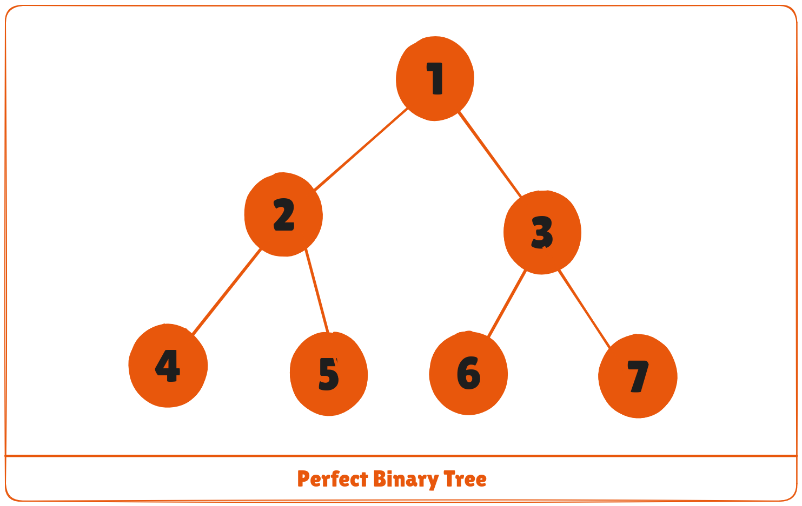
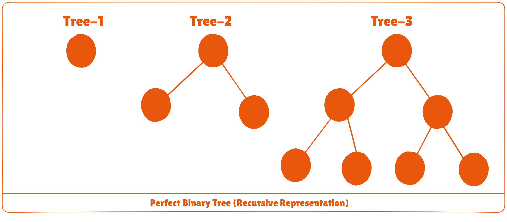

A perfect binary tree is a type of binary tree in which every internal node has exactly two child nodes and all the leaf nodes are at the same level.



All the internal nodes have a degree of 2.

Recursively, a perfect binary tree can be defined as:

1. If a single node has no children, it is a perfect binary tree of height **h = 0**,
2. If a node has **h > 0**, it is a perfect binary tree if both of its subtrees are of height **h - 1** and are non-overlapping.



## Python, Java and C/C++ Examples
The following code is for checking whether a tree is a perfect binary tree.

<CodeGroup>

```python Python
# Checking if a binary tree is a perfect binary tree in Python

class newNode:
    def __init__(self, k):
        self.key = k
        self.right = self.left = None

# calculate the depth of the tree
def calculateDepth(node):
    if node is None:
        return 0
    left_depth = calculateDepth(node.left)
    right_depth = calculateDepth(node.right)
    return max(left_depth, right_depth) + 1


# check if the tree is a perfect binary tree
def is_perfect(root, d, level=0):
    # check if the tree is empty
    if root is None:
        return True

    # check the presence of leaves
    if root.left is None and root.right is None:
        return d == level + 1

    if root.left is None or root.right is None:
        return False

    return is_perfect(root.left, d, level + 1) and is_perfect(root.right, d, level + 1)

root = newNode(1)
root.left = newNode(2)
root.right = newNode(3)
root.left.left = newNode(4)
root.left.right = newNode(5)
root.right.left = newNode(6)
root.right.right = newNode(7)

if is_perfect(root, calculateDepth(root)):
    print("The tree is a perfect binary tree")
else:
    print("The tree is not a perfect binary tree")
```

```java Java
// Checking if a binary tree is a perfect binary tree in Java
class PerfectBinaryTree {

  static class Node {
    int key;
    Node left, right;
  }

  // calculate the depth of the tree considering both left and right subtrees
  static int depth(Node node) {
    if (node == null) {
      return 0;
    }
    int leftDepth = depth(node.left);
    int rightDepth = depth(node.right);
    return Math.max(leftDepth, rightDepth) + 1;
  }

  // check if the tree is a perfect binary tree
  static boolean is_perfect(Node root, int d, int level) {
    // check if the tree is empty
    if (root == null)
      return true;

    // check the presence of leaves
    if (root.left == null && root.right == null)
      return (d == level + 1);

    if (root.left == null || root.right == null)
      return false;

    return is_perfect(root.left, d, level + 1) && is_perfect(root.right, d, level + 1);
  }

  // wrapper function
  static boolean is_Perfect(Node root) {
    int d = depth(root);
    return is_perfect(root, d, 0);
  }

  // create a new node
  static Node newNode(int k) {
    Node node = new Node();
    node.key = k;
    node.right = null;
    node.left = null;
    return node;
  }

  public static void main(String args[]) {
    Node root = null;
    root = newNode(1);
    root.left = newNode(2);
    root.right = newNode(3);
    root.left.left = newNode(4);
    root.left.right = newNode(5);
    root.right.left = newNode(6);
    root.right.right = newNode(7);

    if (is_Perfect(root))
      System.out.println("The tree is a perfect binary tree");
    else
      System.out.println("The tree is not a perfect binary tree");
  }
}
```

```c C
#include <stdbool.h>
#include <stdio.h>
#include <stdlib.h>

struct node {
    int data;
    struct node *left;
    struct node *right;
};

// creating a new node
struct node *newnode(int data) {
    struct node *node = (struct node *)malloc(sizeof(struct node));
    node->data = data;
    node->left = NULL;
    node->right = NULL;

    return (node);
}

// calculate the depth considering both left and right subtrees
int depth(struct node *node) {
    if (node == NULL) {
        return 0;
    }
    int leftDepth = depth(node->left);
    int rightDepth = depth(node->right);
    return (leftDepth > rightDepth ? leftDepth : rightDepth) + 1;
}

// check if the tree is perfect
bool is_perfect(struct node *root, int d, int level) {
    // Check if the tree is empty
    if (root == NULL)
        return true;

    // check the presence of children
    if (root->left == NULL && root->right == NULL)
        return (d == level + 1);

    if (root->left == NULL || root->right == NULL)
        return false;

    return is_perfect(root->left, d, level + 1) &&
           is_perfect(root->right, d, level + 1);
}

// wrapper function
bool is_Perfect(struct node *root) {
    int d = depth(root);
    return is_perfect(root, d, 0);
}

int main() {
    struct node *root = NULL;
    root = newnode(1);
    root->left = newnode(2);
    root->right = newnode(3);
    root->left->left = newnode(4);
    root->left->right = newnode(5);
    root->right->left = newnode(6);
    root->right->right = newnode(7);

    if (is_Perfect(root))
        printf("The tree is a perfect binary tree\n");
    else
        printf("The tree is not a perfect binary tree\n");

    return 0;
}
```

```cpp C++
// Checking if a binary tree is a perfect binary tree in C++

#include <iostream>
using namespace std;

struct Node {
    int key;
    struct Node *left, *right;
};

// calculate the depth considering both left and right subtrees
int depth(Node *node) {
    if (node == NULL) {
        return 0;
    }
    int leftDepth = depth(node->left);
    int rightDepth = depth(node->right);
    return max(leftDepth, rightDepth) + 1;
}

// check if the tree is a perfect binary tree
bool isPerfectR(struct Node *root, int d, int level = 0) {
    if (root == NULL)
        return true;

    if (root->left == NULL && root->right == NULL)
        return (d == level + 1);

    if (root->left == NULL || root->right == NULL)
        return false;

    return isPerfectR(root->left, d, level + 1) &&
           isPerfectR(root->right, d, level + 1);
}

bool isPerfect(Node *root) {
    int d = depth(root);
    return isPerfectR(root, d);
}

// create a new node
struct Node *newNode(int k) {
    struct Node *node = new Node;
    node->key = k;
    node->right = node->left = NULL;
    return node;
}

int main() {
    struct Node *root = NULL;
    root = newNode(1);
    root->left = newNode(2);
    root->right = newNode(3);
    root->left->left = newNode(4);
    root->left->right = newNode(5);
    root->right->left = newNode(6);
    root->right->right = newNode(7);

    if (isPerfect(root))
        cout << "The tree is a perfect binary tree\n";
    else
        cout << "The tree is not a perfect binary tree\n";

    return 0;
}
```

</CodeGroup>

## Perfect Binary Tree Theorems
1. A perfect binary tree of height h has ```2^h + 1``` – 1 node.
2. A perfect binary tree with n nodes has height ```log(n + 1) – 1 = Θ(ln(n))```.
3. A perfect binary tree of height h has ```2^h``` leaf nodes.
4. The average depth of a node in a perfect binary tree is ```Θ(ln(n))```.