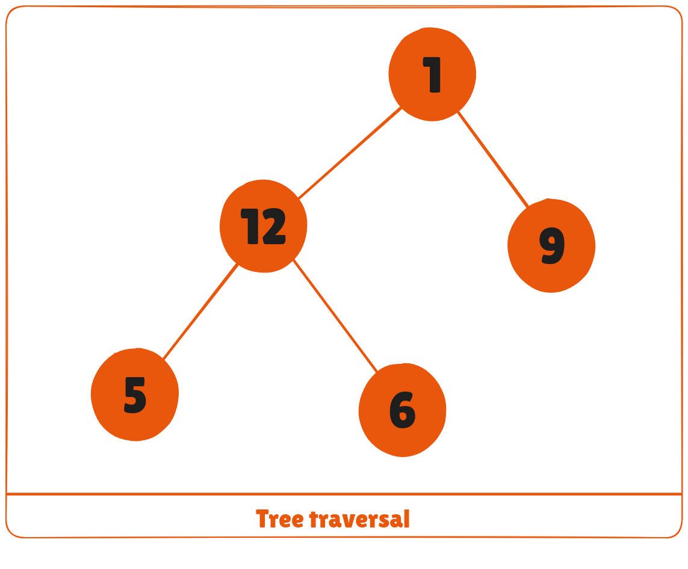
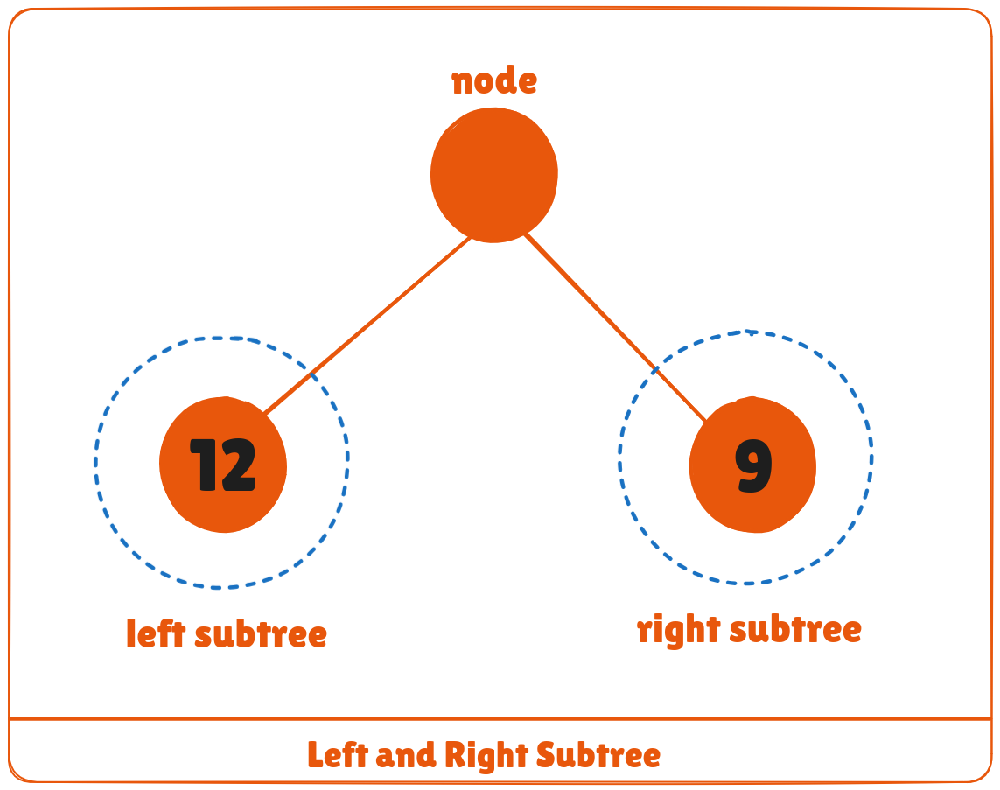
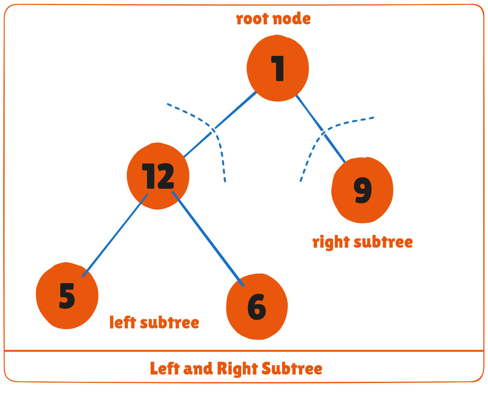
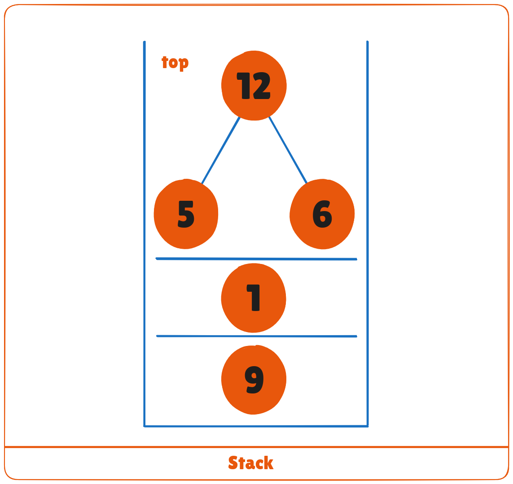
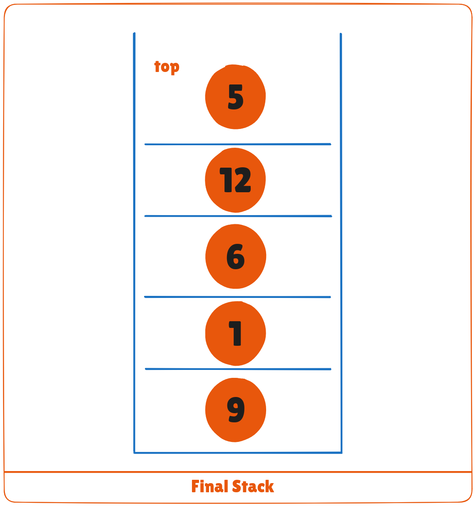

Traversing a tree means visiting every node in the tree. You might, for instance, want to add all the values in the tree or find the largest one. For all these operations, you will need to visit each node of the tree.

Linear data structures like arrays, stacks, queues, and linked list have only one way to read the data. But a hierarchical data structure like a tree can be traversed in different ways.



Let's think about how we can read the elements of the tree in the image shown above.

Starting from top, Left to right

```bash 
1 -> 12 -> 5 -> 6 -> 9
```

Starting from bottom, Left to right

```bash
5 -> 6 -> 12 -> 9 -> 1
```

Although this process is somewhat easy, it doesn't respect the hierarchy of the tree, only the depth of the nodes.

Instead, we use traversal methods that take into account the basic structure of a tree i.e.

```cpp
struct node {
    int data;
    struct node* left;
    struct node* right;
}
```

The struct node pointed to by **left** and **right** might have other left and right children so we should think of them as sub-trees instead of sub-nodes.

According to this structure, every tree is a combination of

* A node carrying data
* Two subtrees



Remember that our goal is to visit each node, so we need to visit all the nodes in the subtree, visit the root node and visit all the nodes in the right subtree as well.

Depending on the order in which we do this, there can be three types of traversal.

## Inorder traversal
1. First, visit all the nodes in the left subtree
2. Then the root node
3. Visit all the nodes in the right subtree

```bash
inorder(root->left)
display(root->data)
inorder(root->right)
```

## Preorder traversal
1. Visit root node
2. Visit all the nodes in the left subtree
3. Visit all the nodes in the right subtree

```bash
display(root->data)
preorder(root->left)
preorder(root->right)
```

## Postorder traversal
1. Visit all the nodes in the left subtree
2. Visit all the nodes in the right subtree
3. Visit the root node

```bash
postorder(root->left)
postorder(root->right)
display(root->data)
```
Let's visualize in-order traversal. We start from the root node.



We traverse the left subtree first. We also need to remember to visit the root node and the right subtree when this tree is done.

Let's put all this in a stack so that we remember.



Now we traverse to the subtree pointed on the TOP of the stack.

Again, we follow the same rule of inorder

```bash
Left subtree -> root -> right subtree
```
After traversing the left subtree, we are left with



Since the node "5" doesn't have any subtrees, we print it directly. After that we print its parent "12" and then the right child "6".

Putting everything on a stack was helpful because now that the left-subtree of the root node has been traversed, we can print it and go to the right subtree.

After going through all the elements, we get the inorder traversal as

```bash
5 -> 12 -> 6 -> 1 -> 9
```

We don't have to create the stack ourselves because recursion maintains the correct order for us.

## Python, Java and C/C++ Examples

<CodeGroup>

```python Python
# Tree traversal in Python


class Node:
    def __init__(self, item):
        self.left = None
        self.right = None
        self.val = item

def inorder(root):

    if root:
        # Traverse left
        inorder(root.left)
        # Traverse root
        print(str(root.val) + "->", end='')
        # Traverse right
        inorder(root.right)

def postorder(root):

    if root:
        # Traverse left
        postorder(root.left)
        # Traverse right
        postorder(root.right)
        # Traverse root
        print(str(root.val) + "->", end='')

def preorder(root):

    if root:
        # Traverse root
        print(str(root.val) + "->", end='')
        # Traverse left
        preorder(root.left)
        # Traverse right
        preorder(root.right)

root = Node(1)
root.left = Node(2)
root.right = Node(3)
root.left.left = Node(4)
root.left.right = Node(5)

print("Inorder traversal ")
inorder(root)

print("\nPreorder traversal ")
preorder(root)

print("\nPostorder traversal ")
postorder(root)
```

```java Java
// Tree traversal in Java
class Node {
  int item;
  Node left, right;

  public Node(int key) {
  item = key;
  left = right = null;
  }
}

class BinaryTree {
  // Root of Binary Tree
  Node root;

  BinaryTree() {
  root = null;
  }

  void postorder(Node node) {
  if (node == null)
    return;

  // Traverse left
  postorder(node.left);
  // Traverse right
  postorder(node.right);
  // Traverse root
  System.out.print(node.item + "->");
  }

  void inorder(Node node) {
  if (node == null)
    return;

  // Traverse left
  inorder(node.left);
  // Traverse root
  System.out.print(node.item + "->");
  // Traverse right
  inorder(node.right);
  }

  void preorder(Node node) {
  if (node == null)
    return;

  // Traverse root
  System.out.print(node.item + "->");
  // Traverse left
  preorder(node.left);
  // Traverse right
  preorder(node.right);
  }

  public static void main(String[] args) {
  BinaryTree tree = new BinaryTree();
  tree.root = new Node(1);
  tree.root.left = new Node(12);
  tree.root.right = new Node(9);
  tree.root.left.left = new Node(5);
  tree.root.left.right = new Node(6);

  System.out.println("Inorder traversal");
  tree.inorder(tree.root);

  System.out.println("\nPreorder traversal ");
  tree.preorder(tree.root);

  System.out.println("\nPostorder traversal");
  tree.postorder(tree.root);
  }
}
```

```c C
// Tree traversal in C
#include <stdio.h>
#include <stdlib.h>

struct node {
  int item;
  struct node* left;
  struct node* right;
};

// Inorder traversal
void inorderTraversal(struct node* root) {
  if (root == NULL) return;
  inorderTraversal(root->left);
  printf("%d ->", root->item);
  inorderTraversal(root->right);
}

// preorderTraversal traversal
void preorderTraversal(struct node* root) {
  if (root == NULL) return;
  printf("%d ->", root->item);
  preorderTraversal(root->left);
  preorderTraversal(root->right);
}

// postorderTraversal traversal
void postorderTraversal(struct node* root) {
  if (root == NULL) return;
  postorderTraversal(root->left);
  postorderTraversal(root->right);
  printf("%d ->", root->item);
}

// Create a new Node
struct node* createNode(value) {
  struct node* newNode = malloc(sizeof(struct node));
  newNode->item = value;
  newNode->left = NULL;
  newNode->right = NULL;

  return newNode;
}

// Insert on the left of the node
struct node* insertLeft(struct node* root, int value) {
  root->left = createNode(value);
  return root->left;
}

// Insert on the right of the node
struct node* insertRight(struct node* root, int value) {
  root->right = createNode(value);
  return root->right;
}

int main() {
  struct node* root = createNode(1);
  insertLeft(root, 12);
  insertRight(root, 9);

  insertLeft(root->left, 5);
  insertRight(root->left, 6);

  printf("Inorder traversal \n");
  inorderTraversal(root);

  printf("\nPreorder traversal \n");
  preorderTraversal(root);

  printf("\nPostorder traversal \n");
  postorderTraversal(root);
}
```


```cpp C++
// Tree traversal in C++

#include <iostream>
using namespace std;

struct Node {
  int data;
  struct Node *left, *right;
  Node(int data) {
    this->data = data;
    left = right = NULL;
  }
};

// Preorder traversal
void preorderTraversal(struct Node* node) {
  if (node == NULL)
    return;

  cout << node->data << "->";
  preorderTraversal(node->left);
  preorderTraversal(node->right);
}

// Postorder traversal
void postorderTraversal(struct Node* node) {
  if (node == NULL)
    return;

  postorderTraversal(node->left);
  postorderTraversal(node->right);
  cout << node->data << "->";
}

// Inorder traversal
void inorderTraversal(struct Node* node) {
  if (node == NULL)
    return;

  inorderTraversal(node->left);
  cout << node->data << "->";
  inorderTraversal(node->right);
}

int main() {
  struct Node* root = new Node(1);
  root->left = new Node(12);
  root->right = new Node(9);
  root->left->left = new Node(5);
  root->left->right = new Node(6);

  cout << "Inorder traversal ";
  inorderTraversal(root);

  cout << "\nPreorder traversal ";
  preorderTraversal(root);

  cout << "\nPostorder traversal ";
  postorderTraversal(root);
  return 0;  
}  
```

</CodeGroup>