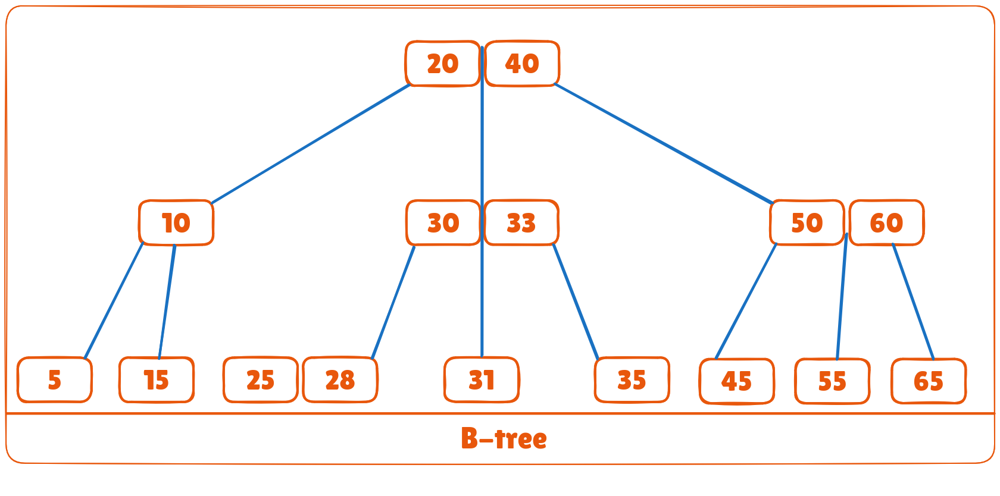
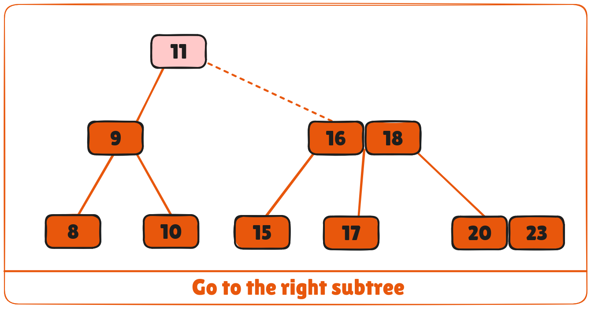
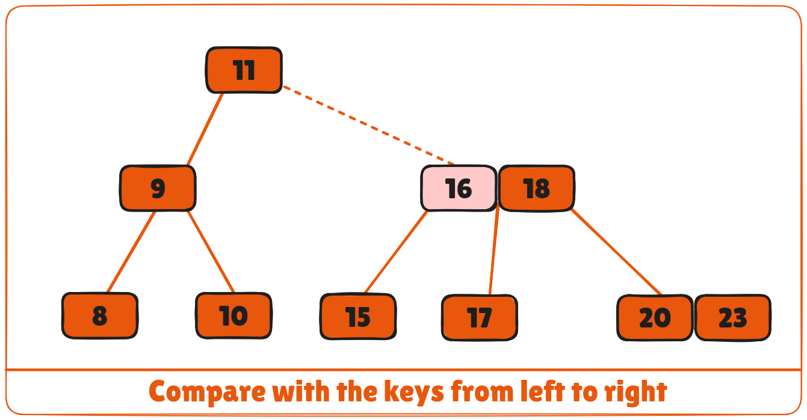
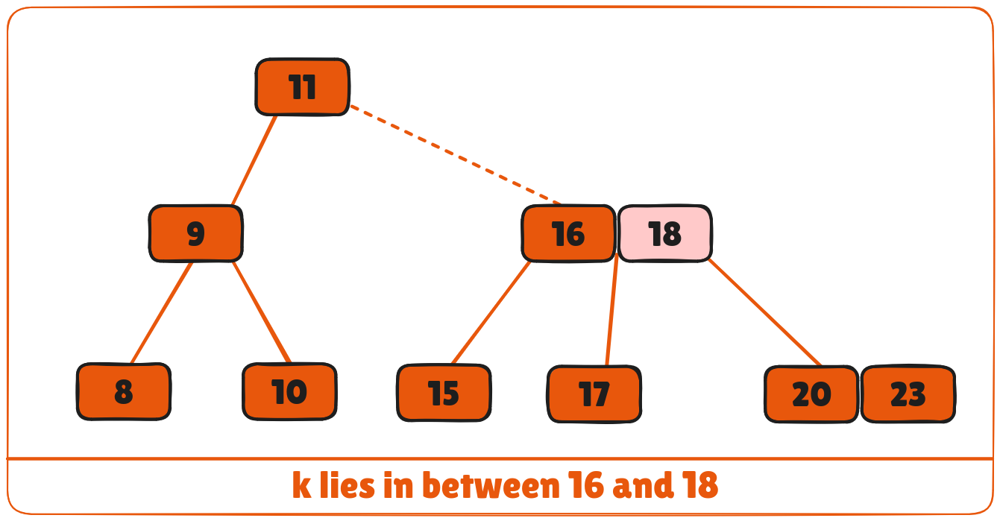
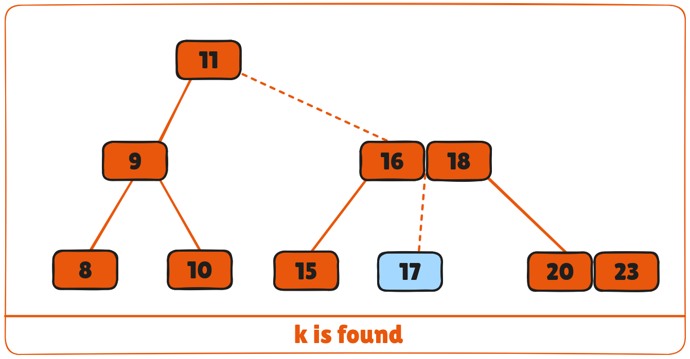

B-tree is a special type of self-balancing search tree in which each node can contain more than one key and can have more than two children. It is a generalized form of the binary search tree.

It is also known as a height-balanced m-way tree.



# Why do you need a B-tree data structure?
The need for B-tree arose with the rise in the need for lesser time in accessing physical storage media like a hard disk. The secondary storage devices are slower with a larger capacity. There was a need for such types of data structures that minimize the disk access.

Other data structures such as a binary search tree, avl tree, red-black tree, etc can store only one key in one node. If you have to store a large number of keys, then the height of such trees becomes very large, and the access time increases.

However, B-tree can store many keys in a single node and can have multiple child nodes. This decreases the height significantly allowing faster disk accesses.

## B-tree Properties
1. For each node ```x```, the keys are stored in increasing order.
2. In each node, there is a boolean value ```x.leaf``` which is true if ```x``` is a leaf.
3. If ```n``` is the order of the tree, each internal node can contain at most ```n - 1``` keys along with a pointer to each child.
4. Each node except root can have at most ```n``` children and at least ```n/2``` children.
5. All leaves have the same depth (i.e. height-h of the tree).
6. The root has at least 2 children and contains a minimum of 1 key.
7. If ```n ≥ 1```, then for any ```n```-key B-tree of height ```h``` and minimum degree ```t``` ≥ 2, ```h``` ≥ ```logt (n+1)/2```.

## Operations on a B-tree
### Searching an element in a B-tree
Searching for an element in a B-tree is the generalized form of searching an element in a Binary Search Tree. The following steps are followed.

1. Starting from the root node, compare k with the first key of the node.
2. If ```k = the first key of the node```, return the node and the index.
3. If ```k.leaf = true```, return NULL (i.e. not found).
4. If ```k < the first key of the root node```, search the left child of this key recursively.
5. If there is more than one key in the current node and ```k > the first key```, compare ```k``` with the next key in the node.
6. If ```k < next key```, search the left child of this key (ie. k lies in between the first and the second keys).
7. Else, search the right child of the key.
Repeat steps 1 to 4 until the leaf is reached.

### Searching Example
1. Let us search key ```k = 17``` in the tree below of degree 3.


2. ```k``` is not found in the root so, compare it with the root key.


3. Since ```k > 11```, go to the right child of the root node.



4. Compare k with 16. Since ```k > 16```, compare k with the next key 18.



5. Since ```k < 18```, k lies between 16 and 18. Search in the right child of 16 or the left child of 18.



6. ```k``` is found.



## Algorithm for Searching an Element
```bash
BtreeSearch(x, k)
 i = 1
 while i ≤ n[x] and k ≥ keyi[x]        // n[x] means number of keys in x node
    do i = i + 1
if i  n[x] and k = keyi[x]
    then return (x, i)
if leaf [x]
    then return NIL
else
    return BtreeSearch(ci[x], k)
```

To learn more about different B-tree operations, please visit

* Insertion on B-tree
* Deletion on B-tree

## B-tree operations code in Python, Java, and C/C++

<CodeGroup>

```python Python
# Searching a key on a B-tree in Python

# Create a node
class BTreeNode:
    def __init__(self, leaf=False):
        self.leaf = leaf
        self.keys = []
        self.child = []
        
# Tree       
class BTree:
    def __init__(self, t):
        self.root = BTreeNode(True)
        self.t = t
        
    # Insert a key
    def insert(self, k):
        root = self.root
        if len(root.keys) == (2 * self.t) - 1:
            temp = BTreeNode()
            self.root = temp
            temp.child.insert(0, root)
            self.split_child(temp, 0)
            self.insert_non_full(temp, k)
        else:
            self.insert_non_full(root, k)
            
    # Insert non full
    def insert_non_full(self, x, k):
        i = len(x.keys) - 1
        if x.leaf:
            x.keys.append((None, None))
            while i >= 0 and k[0] < x.keys[i][0]:
                x.keys[i + 1] = x.keys[i]
                i -= 1
            x.keys[i + 1] = k
        else:
            while i >= 0 and k[0] < x.keys[i][0]:
                i -= 1
            i += 1
            if len(x.child[i].keys) == (2 * self.t) - 1:
                self.split_child(x, i)
                if k[0] > x.keys[i][0]:
                    i += 1
            self.insert_non_full(x.child[i], k)
            
    # Split the child
    def split_child(self, x, i):
        t = self.t
        y = x.child[i]
        z = BTreeNode(y.leaf)
        x.child.insert(i + 1, z)
        x.keys.insert(i, y.keys[t - 1])
        z.keys = y.keys[t: (2 * t) - 1]
        y.keys = y.keys[0: t - 1]
        if not y.leaf:
            z.child = y.child[t: 2 * t]
            y.child = y.child[0: t]
            
    # Delete a node
    def delete(self, x, k):
        t = self.t
        i = 0
        while i < len(x.keys) and k[0] > x.keys[i][0]:
            i += 1
        if x.leaf:
            # Case 1: Node is a leaf
            if i < len(x.keys) and x.keys[i][0] == k[0]:
                x.keys.pop(i)
                return
        else:
            # Case 2: Key is found in an internal node
            if i < len(x.keys) and x.keys[i][0] == k[0]:
                return self.delete_internal_node(x, k, i)
            # Case 3: Key is not in node, go to the proper child
            if len(x.child[i].keys) < t:
                self.fill(x, i)
            self.delete(x.child[i], k)
            
    def delete_internal_node(self, x, k, i):
        t = self.t
        # Case 2a: Predecessor has enough keys
        if len(x.child[i].keys) >= t:
            pred_key = self.get_predecessor(x, i)
            x.keys[i] = pred_key
            self.delete(x.child[i], pred_key)
        # Case 2b: Successor has enough keys
        elif len(x.child[i + 1].keys) >= t:
            succ_key = self.get_successor(x, i)
            x.keys[i] = succ_key
            self.delete(x.child[i + 1], succ_key)
        # Case 2c: Both children have fewer than t keys
        else:
            self.merge(x, i)
            self.delete(x.child[i], k)
            
    def get_predecessor(self, x, i):
        cur = x.child[i]
        while not cur.leaf:
            cur = cur.child[len(cur.child) - 1]
        return cur.keys[len(cur.keys) - 1]
        
    def get_successor(self, x, i):
        cur = x.child[i + 1]
        while not cur.leaf:
            cur = cur.child[0]
        return cur.keys[0]
        
    # Merge function to merge two children
    def merge(self, x, i):
        t = self.t
        child = x.child[i]
        sibling = x.child[i + 1]
        # Merge key from x to child
        child.keys.append(x.keys[i])
        # Append sibling's keys to child
        child.keys.extend(sibling.keys)
        # If sibling has children, append them to child
        if not child.leaf:
            child.child.extend(sibling.child)
        # Remove the key from x and delete sibling from child list
        x.keys.pop(i)
        x.child.pop(i + 1)
        # If root becomes empty, reduce the height of the tree
        if len(x.keys) == 0:
            self.root = child
            
    # Fill function to ensure child has at least t keys
    def fill(self, x, i):
        t = self.t
        # Borrow from the previous sibling
        if i != 0 and len(x.child[i - 1].keys) >= t:
            self.borrow_from_prev(x, i)
        # Borrow from the next sibling
        elif i != len(x.child) - 1 and len(x.child[i + 1].keys) >= t:
            self.borrow_from_next(x, i)
        # Merge with sibling
        else:
            if i != len(x.child) - 1:
                self.merge(x, i)
            else:
                self.merge(x, i - 1)
                
    def borrow_from_prev(self, x, i):
        child = x.child[i]
        sibling = x.child[i - 1]
        # Move the last key from sibling to x
        child.keys.insert(0, x.keys[i - 1])
        x.keys[i - 1] = sibling.keys.pop()
        # Move the last child of sibling to child if sibling is not a leaf
        if not child.leaf:
            child.child.insert(0, sibling.child.pop())
            
    def borrow_from_next(self, x, i):
        child = x.child[i]
        sibling = x.child[i + 1]
        # Move the first key from sibling to x
        child.keys.append(x.keys[i])
        x.keys[i] = sibling.keys.pop(0)
        # Move the first child of sibling to child if sibling is not a leaf
        if not child.leaf:
            child.child.append(sibling.child.pop(0))
            
    # Print the tree
    def print_tree(self, x, l=0):
        print("Level ", l, " ", len(x.keys), end=":")
        for i in x.keys:
            print(i, end=" ")
        print()
        l += 1
        if len(x.child) > 0:
            for i in x.child:
                self.print_tree(i, l)
                
# Example usage
B = BTree(3)
for i in range(10):
    B.insert((i, 2 * i))
B.print_tree(B.root)
B.delete(B.root, (8,))
print("\n")
B.print_tree(B.root)
```

```java Java

// Searching a key on a B-tree in Java 

public class BTree {

  private int T;

  // Node creation
  public class Node {
    int n;
    int key[] = new int[2 * T - 1];
    Node child[] = new Node[2 * T];
    boolean leaf = true;

    public int Find(int k) {
      for (int i = 0; i < this.n; i++) {
        if (this.key[i] == k) {
          return i;
        }
      }
      return -1;
    };
  }

  public BTree(int t) {
    T = t;
    root = new Node();
    root.n = 0;
    root.leaf = true;
  }

  private Node root;

  // Search key
  private Node Search(Node x, int key) {
    int i = 0;
    if (x == null)
      return x;
    for (i = 0; i < x.n; i++) {
      if (key < x.key[i]) {
        break;
      }
      if (key == x.key[i]) {
        return x;
      }
    }
    if (x.leaf) {
      return null;
    } else {
      return Search(x.child[i], key);
    }
  }

  // Splitting the node
  private void Split(Node x, int pos, Node y) {
    Node z = new Node();
    z.leaf = y.leaf;
    z.n = T - 1;
    for (int j = 0; j < T - 1; j++) {
      z.key[j] = y.key[j + T];
    }
    if (!y.leaf) {
      for (int j = 0; j < T; j++) {
        z.child[j] = y.child[j + T];
      }
    }
    y.n = T - 1;
    for (int j = x.n; j >= pos + 1; j--) {
      x.child[j + 1] = x.child[j];
    }
    x.child[pos + 1] = z;

    for (int j = x.n - 1; j >= pos; j--) {
      x.key[j + 1] = x.key[j];
    }
    x.key[pos] = y.key[T - 1];
    x.n = x.n + 1;
  }

  // Inserting a value
  public void Insert(final int key) {
    Node r = root;
    if (r.n == 2 * T - 1) {
      Node s = new Node();
      root = s;
      s.leaf = false;
      s.n = 0;
      s.child[0] = r;
      Split(s, 0, r);
      insertValue(s, key);
    } else {
      insertValue(r, key);
    }
  }

  // Insert the node
  final private void insertValue(Node x, int k) {

    if (x.leaf) {
      int i = 0;
      for (i = x.n - 1; i >= 0 && k < x.key[i]; i--) {
        x.key[i + 1] = x.key[i];
      }
      x.key[i + 1] = k;
      x.n = x.n + 1;
    } else {
      int i = 0;
      for (i = x.n - 1; i >= 0 && k < x.key[i]; i--) {
      }
      ;
      i++;
      Node tmp = x.child[i];
      if (tmp.n == 2 * T - 1) {
        Split(x, i, tmp);
        if (k > x.key[i]) {
          i++;
        }
      }
      insertValue(x.child[i], k);
    }

  }

  public void Show() {
    Show(root);
  }

  // Display
  private void Show(Node x) {
    assert (x == null);
    for (int i = 0; i < x.n; i++) {
      System.out.print(x.key[i] + " ");
    }
    if (!x.leaf) {
      for (int i = 0; i < x.n + 1; i++) {
        Show(x.child[i]);
      }
    }
  }

  // Check if present
  public boolean Contain(int k) {
    if (this.Search(root, k) != null) {
      return true;
    } else {
      return false;
    }
  }

  public static void main(String[] args) {
    BTree b = new BTree(3);
    b.Insert(8);
    b.Insert(9);
    b.Insert(10);
    b.Insert(11);
    b.Insert(15);
    b.Insert(20);
    b.Insert(17);

    b.Show();

    if (b.Contain(12)) {
      System.out.println("\nfound");
    } else {
      System.out.println("\nnot found");
    }
    ;
  }
}
```

```c C 
// Searching a key on a B-tree in C

#include <stdio.h>
#include <stdlib.h>

#define MAX 3
#define MIN 2

struct BTreeNode {
  int val[MAX + 1], count;
  struct BTreeNode *link[MAX + 1];
};

struct BTreeNode *root;

// Create a node
struct BTreeNode *createNode(int val, struct BTreeNode *child) {
  struct BTreeNode *newNode;
  newNode = (struct BTreeNode *)malloc(sizeof(struct BTreeNode));
  newNode->val[1] = val;
  newNode->count = 1;
  newNode->link[0] = root;
  newNode->link[1] = child;
  return newNode;
}

// Insert node
void insertNode(int val, int pos, struct BTreeNode *node,
        struct BTreeNode *child) {
  int j = node->count;
  while (j > pos) {
    node->val[j + 1] = node->val[j];
    node->link[j + 1] = node->link[j];
    j--;
  }
  node->val[j + 1] = val;
  node->link[j + 1] = child;
  node->count++;
}

// Split node
void splitNode(int val, int *pval, int pos, struct BTreeNode *node,
         struct BTreeNode *child, struct BTreeNode **newNode) {
  int median, j;

  if (pos > MIN)
    median = MIN + 1;
  else
    median = MIN;

  *newNode = (struct BTreeNode *)malloc(sizeof(struct BTreeNode));
  j = median + 1;
  while (j <= MAX) {
    (*newNode)->val[j - median] = node->val[j];
    (*newNode)->link[j - median] = node->link[j];
    j++;
  }
  node->count = median;
  (*newNode)->count = MAX - median;

  if (pos <= MIN) {
    insertNode(val, pos, node, child);
  } else {
    insertNode(val, pos - median, *newNode, child);
  }
  *pval = node->val[node->count];
  (*newNode)->link[0] = node->link[node->count];
  node->count--;
}

// Set the value
int setValue(int val, int *pval,
           struct BTreeNode *node, struct BTreeNode **child) {
  int pos;
  if (!node) {
    *pval = val;
    *child = NULL;
    return 1;
  }

  if (val < node->val[1]) {
    pos = 0;
  } else {
    for (pos = node->count;
       (val < node->val[pos] && pos > 1); pos--)
      ;
    if (val == node->val[pos]) {
      printf("Duplicates are not permitted\n");
      return 0;
    }
  }
  if (setValue(val, pval, node->link[pos], child)) {
    if (node->count < MAX) {
      insertNode(*pval, pos, node, *child);
    } else {
      splitNode(*pval, pval, pos, node, *child, child);
      return 1;
    }
  }
  return 0;
}

// Insert the value
void insert(int val) {
  int flag, i;
  struct BTreeNode *child;

  flag = setValue(val, &i, root, &child);
  if (flag)
    root = createNode(i, child);
}

// Search node
void search(int val, int *pos, struct BTreeNode *myNode) {
  if (!myNode) {
    return;
  }

  if (val < myNode->val[1]) {
    *pos = 0;
  } else {
    for (*pos = myNode->count;
       (val < myNode->val[*pos] && *pos > 1); (*pos)--)
      ;
    if (val == myNode->val[*pos]) {
      printf("%d is found", val);
      return;
    }
  }
  search(val, pos, myNode->link[*pos]);

  return;
}

// Traverse then nodes
void traversal(struct BTreeNode *myNode) {
  int i;
  if (myNode) {
    for (i = 0; i < myNode->count; i++) {
      traversal(myNode->link[i]);
      printf("%d ", myNode->val[i + 1]);
    }
    traversal(myNode->link[i]);
  }
}

int main() {
  int val, ch;

  insert(8);
  insert(9);
  insert(10);
  insert(11);
  insert(15);
  insert(16);
  insert(17);
  insert(18);
  insert(20);
  insert(23);

  traversal(root);

  printf("\n");
  search(11, &ch, root);
}
```

```cpp C++ 
// Searching a key on a B-tree in C++

#include <iostream>
using namespace std;

class TreeNode {
  int *keys;
  int t;
  TreeNode **C;
  int n;
  bool leaf;

   public:
  TreeNode(int temp, bool bool_leaf);

  void insertNonFull(int k);
  void splitChild(int i, TreeNode *y);
  void traverse();

  TreeNode *search(int k);

  friend class BTree;
};

class BTree {
  TreeNode *root;
  int t;

   public:
  BTree(int temp) {
    root = NULL;
    t = temp;
  }

  void traverse() {
    if (root != NULL)
      root->traverse();
  }

  TreeNode *search(int k) {
    return (root == NULL) ? NULL : root->search(k);
  }

  void insert(int k);
};

TreeNode::TreeNode(int t1, bool leaf1) {
  t = t1;
  leaf = leaf1;

  keys = new int[2 * t - 1];
  C = new TreeNode *[2 * t];

  n = 0;
}

void TreeNode::traverse() {
  int i;
  for (i = 0; i < n; i++) {
    if (leaf == false)
      C[i]->traverse();
    cout << " " << keys[i];
  }

  if (leaf == false)
    C[i]->traverse();
}

TreeNode *TreeNode::search(int k) {
  int i = 0;
  while (i < n && k > keys[i])
    i++;

  if (keys[i] == k)
    return this;

  if (leaf == true)
    return NULL;

  return C[i]->search(k);
}

void BTree::insert(int k) {
  if (root == NULL) {
    root = new TreeNode(t, true);
    root->keys[0] = k;
    root->n = 1;
  } else {
    if (root->n == 2 * t - 1) {
      TreeNode *s = new TreeNode(t, false);

      s->C[0] = root;

      s->splitChild(0, root);

      int i = 0;
      if (s->keys[0] < k)
        i++;
      s->C[i]->insertNonFull(k);

      root = s;
    } else
      root->insertNonFull(k);
  }
}

void TreeNode::insertNonFull(int k) {
  int i = n - 1;

  if (leaf == true) {
    while (i >= 0 && keys[i] > k) {
      keys[i + 1] = keys[i];
      i--;
    }

    keys[i + 1] = k;
    n = n + 1;
  } else {
    while (i >= 0 && keys[i] > k)
      i--;

    if (C[i + 1]->n == 2 * t - 1) {
      splitChild(i + 1, C[i + 1]);

      if (keys[i + 1] < k)
        i++;
    }
    C[i + 1]->insertNonFull(k);
  }
}

void TreeNode::splitChild(int i, TreeNode *y) {
  TreeNode *z = new TreeNode(y->t, y->leaf);
  z->n = t - 1;

  for (int j = 0; j < t - 1; j++)
    z->keys[j] = y->keys[j + t];

  if (y->leaf == false) {
    for (int j = 0; j < t; j++)
      z->C[j] = y->C[j + t];
  }

  y->n = t - 1;
  for (int j = n; j >= i + 1; j--)
    C[j + 1] = C[j];

  C[i + 1] = z;

  for (int j = n - 1; j >= i; j--)
    keys[j + 1] = keys[j];

  keys[i] = y->keys[t - 1];
  n = n + 1;
}

int main() {
  BTree t(3);
  t.insert(8);
  t.insert(9);
  t.insert(10);
  t.insert(11);
  t.insert(15);
  t.insert(16);
  t.insert(17);
  t.insert(18);
  t.insert(20);
  t.insert(23);

  cout << "The B-tree is: ";
  t.traverse();

  int k = 10;
  (t.search(k) != NULL) ? cout << endl
                 << k << " is found"
              : cout << endl
                 << k << " is not Found";

  k = 2;
  (t.search(k) != NULL) ? cout << endl
                 << k << " is found"
              : cout << endl
                 << k << " is not Found\n";
}
```

</CodeGroup>

## Searching Complexity on B Tree
* Worst case Time complexity: ```Θ(log n)```
* Average case Time complexity: ```Θ(log n)```
* Best case Time complexity: ```Θ(log n)```
* Average case Space complexity: ```Θ(n)```
* Worst case Space complexity: ```Θ(n)```

## B Tree Applications
* Databases and file systems
* To store blocks of data (secondary storage media)
* Multilevel indexing